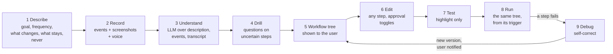
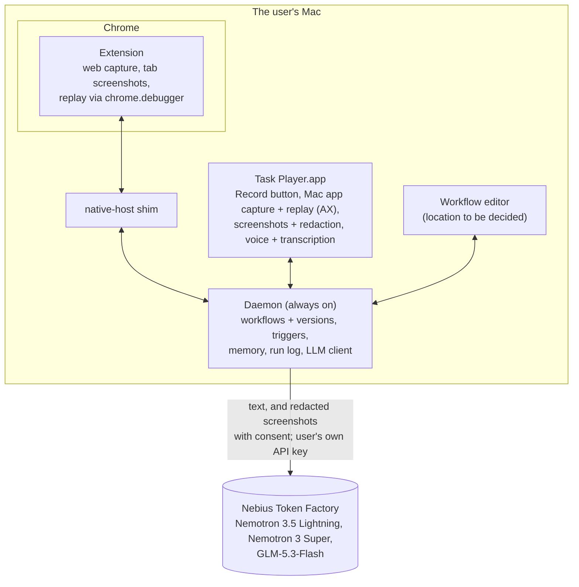

# Task Player Design

> **Updated Oct 8, 2026: the workflow pivot.** A task is now taught by **describing it and recording it** (with optional voice narration), turned into an **editable workflow tree** by an LLM, tested, and replayed with **self-correction**. This file is the source of truth. The earlier live design doc (Sep 30) describes the old flat-skill flow and is out of date. The skill format is migrated (Oct 8); most of the rest of the flow is not built yet: see [Status: design vs code](#status-design-vs-code).

Task Player learns a work task from a description and one demonstration, shows the user the workflow it understood, lets them correct it, and then runs it for them, fixing itself when a site changes.

## Why the pivot

Scoring real workflows ([examples.md](examples.md)) showed that a recording alone does not say **why**: which email, which values change, where a typed sentence came from, when a choice is a judgement call. A one-shot compile of clicks into a flat list of steps replays literal values and cannot express "for each" or "only if". So the user now tells us the why (description and voice), sees what we understood (the tree), and fixes it before anything runs.

## The flow



### 1. Describe

Before recording, the user fills in a short form. Each field has placeholder text that explains why it matters.

| Field | Input | Placeholder (shown to the user) | Used for |
| --- | --- | --- | --- |
| **Goal** | free text | "What is done when this task is done? e.g. *This week's revenue, signups and churn are in the KPI sheet*" | The workflow's intent; success checks |
| **Frequency** | dropdown | Proposed options: Only when I start it · Every hour · Every day at… · Weekdays at… · Every week on… at… · Every month on day… at… · When a file appears in a folder… | The workflow's trigger |
| **What changes each run** | free text, comma-separated | "e.g. *the email, the numbers, the week's date*" | Variables: values that must not be replayed literally |
| **What stays the same** | free text, comma-separated | "e.g. *the sender Reporting Bot, the KPI 2026 sheet, the column names*" | Constants the workflow may hard-code |
| **Never** (optional) | free text, comma-separated | "e.g. *send anything without asking, delete files*" | Guard rails: matching steps always need approval, or are refused |

### 2. Record

The user presses Record and does the task their usual way. Three streams are captured on one clock, so each piece lines up with the others by timestamp:

- **Events:** web clicks, typing, selects, files, drops, drags, copy and paste (extension); Mac app clicks, values, menus and shortcuts (Task Player.app, Accessibility API); file moves and renames (daemon, FSEvents). As today.
- **A screenshot at each event** (only with the user's **screen** consent): only the active window, with sensitive information blacked out before it is stored (see [Consent, redaction and retention](#consent-redaction-and-retention)). Mac app windows need macOS's **Screen Recording** permission; Chrome's visible tab is captured by the extension without it.
- **Voice** (optional, only with the user's **microphone** consent): the user can narrate while working ("I always take the newest one from Reporting Bot"). macOS's built-in speech recognizer (**SpeechAnalyzer**, macOS 26) transcribes it on the Mac with word timestamps; the transcript is split into segments aligned with the events. The audio itself is never sent anywhere; the transcript text is.

Without consent, recording still works from events alone.

### 3. Understand

Nemotron 3 Super (the `understand` role, see [Models](#models)) reads the description, the event trace, the aligned transcript and memory of earlier answers. With screen consent, GLM-5.3-Flash (the `vision` role) first describes the redacted screenshots around events the trace alone cannot explain, and those descriptions are added as text. The result is a draft workflow tree. Its job is to turn behaviour into intent:

- a click on an email becomes "the newest email from Reporting Bot", using the description and the narration;
- values the description says change become variables, never literals;
- repeated actions become a loop, and "only if" in the narration becomes a branch;
- judgement and text work (summarise, classify, read a document) become LLM steps;
- anything still unclear is marked uncertain for the drill.

When the skill is finalised, the recording's raw files are scheduled for deletion ([retention](#retention)).

### 4. Drill

Questions go only to steps marked uncertain, shown on the draft tree ("Is this always the newest email, or a specific one?"). Answers update the tree and are saved to memory, so the same question is not asked again for this workflow or site.

### 5. The workflow tree

The finished workflow is shown to the user as a tree. Example, workflow 1 in [examples.md](examples.md):

```
Weekly KPI email → Sheet                          trigger: every week on Monday at 09:00
  variables: week_start = this Monday · kpis (from step 3)
  1  browser  open the Gmail inbox
  2  browser  open the newest email from "Reporting Bot" with "Weekly metrics" in the subject
  3  llm      read Revenue, Signups and Churn from the email body → kpis { revenue, signups, churn }
  4  browser  open the "KPI 2026" sheet
  5  browser  write week_start and kpis into the first empty row, by column header      [approval]
```

And one with a loop, a branch and an ask (workflow 2):

```
Vendor invoices → Xero                            trigger: every day at 10:00
  for each unread email labelled "Invoices"
    1  browser  download the PDF attachment
    2  llm      read vendor, invoice number, amount and due date from the PDF → invoice
    3  if invoice.amount > 5000
         ask     "Large invoice from {{invoice.vendor}}. Continue?"
    4  mac      rename it {{invoice.vendor}}-{{invoice.number}}-{{invoice.date}}.pdf, move to Invoices/{{month}}
    5  browser  create a bill in Xero with invoice's fields, attach the PDF                [approval]
    6  browser  label the email "Processed"
```

### 6. Edit

The user can edit any step (its target, values, wording), add, remove or reorder steps, and **toggle human approval** on any step. Steps that send, submit, pay, publish or delete start with approval on, and so do steps matching a "Never" entry.

### 7. Test

**Play** runs the tree instantly as a **highlight-only** replay: each step's target is found and highlighted, with nothing clicked, typed or sent. *Not final:* steps whose targets only appear after an earlier action (a page reached by clicking) cannot be highlighted without doing that action, so this mode will change.

### 8. Run

Runs execute **exactly the tree the user saw**, started by the trigger from Frequency or by hand. Action steps are deterministic: no model call unless an LLM step asks for one, or a step fails. The engine is the one already built (see [Replay engine](#replay-engine)).

### 9. Debug and self-correct

When a step fails after its retries (target not found, check not met), a **debug** step takes over:

1. Nemotron 3 Super (the `debug` role) gets the step's intent, the failure, the stored target and its top candidates, the current page or window outline, and the recent run log. With screen consent, a redacted screenshot of the page is described by the `vision` role and added as text.
2. It proposes a correction: a new target, an extra step (dismiss a new banner), or a longer wait.
3. The player runs the corrected step. If its check passes, the run continues.
4. The corrected workflow is **saved as a new version automatically**. Every version is kept. The user is notified with what changed and a **single click rolls back** to the previous version.

Debug proposes; the player executes. Debug never adds a step that sends, submits, pays, publishes or deletes, and never changes a value the user set; those failures go to the user instead.

## The workflow format

The skill is the contract between record and replay, and a skill **is** a workflow. Source of truth: `packages/core/src/skill.ts` (the schema and the args of every action), `vars.ts` (types and references) and `check.ts` (the variable check). The workflow replay receives is final: the drill happened at record time.

**On the skill:** `id`, `name` (short, for lists and notifications), `version`, `description` `{ goal, changes[], constants[], never[] }` (the form), `steps` (the tree), `success` (final checks) and `history` (one note per version: `by` record, user or debug, a summary and a time).

**The first step is always the trigger:** `{ id, type: "trigger", intent, when, inputs }`. `when` is the Frequency (`manual`, `schedule` with a cron, `folder_watch`); `inputs` are the values a run starts with, each `{ type, description?, default?, resolve?, example? }`. A value given with `run`, a file resolver ("the newest PDF in ~/Downloads"), or the default fills it; `example` is what was seen while recording.

**Every other step** has `id` (unique across the tree), `type`, `intent` (what it is for: the editor shows it, debug relies on it), `requires_approval` and an optional `ask` (`{ question, kind: "value" | "confirm", output }`, asked before the step runs). Then by type:

| `type` | What it does | Fields |
| --- | --- | --- |
| `action` | One step in the browser, a Mac app, files or a script | `channel` (`web`, `ax`, `fs`, `script`, `data`), `action`, `target` (a locator, never coordinates), `args`, `wait`, `check`, `output`, `timeout_ms`, `on_fail` |
| `llm` | **Transform only**: summarise, classify, read text, compute. Never drives the UI, gets no tools | `instruction`, `inputs` (references to the data it reads), `output` (required; never a file or secret). The model's answer is checked against the output's type |
| `control`, `kind: "loop"` | Runs its `steps` for each item of a list | `over` (a reference to a list), `item` (the current item, a variable visible only inside the loop), `max_items` (100), `on_item_fail` (`stop` or `skip`), `steps` |
| `control`, `kind: "branch"` | Runs its `steps` if a condition holds, its `else` steps otherwise | `if` (a comparison `{ left, op, right }` with `equals`, `not_equals`, `contains`, `greater_than`, `less_than`, `exists`, `not_exists`; or `all` / `any` / `not` of conditions), `steps`, `else`. No `then` key: an object with one is treated as a promise by `await` |

### Variables

Every value a step reads is a **variable declared, with its type, by an earlier step**: the trigger's `inputs`, an action's or llm step's `output` (`{ name, type }`), an ask's `output`, or a loop's `item`. Names are unique in a skill, and each variable is set by exactly one step.

**Types** (a fixed set, one way to write each):

| Type | Value |
| --- | --- |
| `{ "type": "text" }` | a string |
| `{ "type": "number" }` | a number |
| `{ "type": "boolean" }` | true or false |
| `{ "type": "date" }` | `"YYYY-MM-DD"` |
| `{ "type": "file" }` | `{ path, name, size, modified }`: `{{invoice_file.path}}`, `{{invoice_file.name}}` are ordinary fields |
| `{ "type": "secret" }` | text that is never logged, stored or sent to the model |
| `{ "type": "list", "items": <type> }` | a list of one type |
| `{ "type": "object", "fields": { name: <type> } }` | an object; without `fields`, rows of any shape (a sheet read by its header) |

**References:** `{{name}}`, then `.field` for an object's field and `.N` for a list item: `{{invoice.amount}}`, `{{emails.0.subject}}`, `{{email.body}}` (inside a loop); `{{today}}` is built in. A string that is exactly one reference keeps the value's type (a list stays a list); inside longer text the value becomes text, objects and lists as JSON. A file value can be given wherever a path is expected.

**Visibility:** a reference is valid only after the step that declares the variable, at the same level or an enclosing one. A loop's item and anything produced inside the loop exist only inside it. A variable produced inside a branch exists after it only if both arms produce it with the same type.

**What each action produces** (and so the outputs it may declare): `web.extract` gives text, a list of text (`all`), or a list of row objects (`source`); `fs.find` a file, or a list of files (`pick: "all"`); `fs.move` and `fs.copy` a file or a list of files; `fs.rename` and `fs.write` a file; `fs.read` text; `data.pick` text (with `column`) or a row object; `script` steps text. Other actions produce nothing, and declaring an output on them is an error. Text may be declared as number, boolean or date and is converted at run time ("1,234" becomes 1234).

**Checked twice.** When a skill is parsed (saved by the recorder, the editor or debug), `check.ts` verifies every reference: the variable is declared and visible at that step, the field exists, a loop runs over a list whose items match its `item`, names are unique, and each output fits what its action produces. Errors name the exact place, e.g. `steps.2.steps.3.args.from: {{pdf.pth}} has no such field: pdf is a file`. At run time, a step whose reference has no value stops with that name, and every output is checked against its declared type before it is saved.

## Architecture



There is **no backend server**: the daemon is the backend. It runs on the user's Mac and calls Token Factory directly with the user's own API key. The extension and Task Player.app never call a model; everything goes through the daemon ([Deployment](#deployment)).

**Why a native host shim.** Chrome launches a fresh process for every native messaging connection, so it cannot attach to the always-on daemon. The shim (`apps/native-host`) is what Chrome launches; it forwards bytes to the daemon's Unix socket (`~/Library/Application Support/TaskPlayer/daemon.sock`, at most 103 bytes long, a macOS limit). Only the extension can open the connection, so it connects on startup and reconnects with `chrome.alarms`.

## Replay engine

Built and unchanged by the pivot; the workflow interpreter will call it for every action node.

- **Matching, never coordinates.** A stored target is found again on the live page by Chrome's own accessibility tree (role, with equivalent roles grouped, and accessible name), stored attributes and fallback selectors, weighted 0.45 / 0.25 / 0.30. One clear winner (score ≥ 0.5, margin 0.15 over the runner-up) is required; otherwise the step reports "not found" or "ambiguous" with the top candidates. Positions are read at the moment of acting.
- **Acting like a person.** Trusted CDP input: a mouse press at the element's current centre after checking nothing covers it; typing as keyDown/keyUp per character (inserting text at once leaves widgets such as date pickers with stale state). Uploads hand the file to the page's file input (in the target, its dialog, the page or a shadow root) or drop it, with no native dialog.
- **Waiting.** Navigation waits until the document is parsed; each step then waits for its own target and checks its result.
- **Where it runs.** Web steps run in a dedicated, unfocused 1280×800 Chrome window through `chrome.debugger`; Mac app steps through Task Player.app; files and scripts in the daemon. `pnpm replay` runs the same code in a separate debug-port Chrome for development.
- **The interpreter.** Walks the tree in order. A loop resolves `over`, refuses more than `max_items`, gives each item its own scope (the item and whatever its steps produce, dropped afterwards), and on a failing item stops or, with `on_item_fail: "skip"`, logs it and goes on; a denial always stops. A branch evaluates its condition (numbers written as text compare as numbers, ISO dates as dates, a reference with no value counts as missing for `exists`), runs one arm in its own scope and keeps only the variables both arms produce. An `ask` runs before its step: a value answer is converted to the output's type, a "no" to a confirm skips the step, and with no way to ask the run stops rather than guess. Approval on a loop is asked once; on a step inside it, once per item.
- **Run log.** Every run records each step with where it ran (`l1[2] > s3`: step s3 on the third item of loop l1), its match score, result and retries, plus loop items, branch choices, asks and skipped steps; its first line names the skill version that ran.

## Memory

Local SQLite in the daemon: facts and preferences from drill answers, run context, and site notes from debug fixes. The understanding step and debug read it. Users can view and delete entries. It never stores secrets.

## Models

All model calls go to **Nebius Token Factory** (OpenAI-compatible API, `https://api.tokenfactory.nebius.com/v1/`), through one package, `packages/llm`. Callers ask for a **role**, never a model, so models can be swapped in config without touching record or replay code.

| Role | Model (Token Factory id) | Used by | Price per 1M tokens (in / out) | Settings |
| --- | --- | --- | --- | --- |
| `transform` | NVIDIA Nemotron 3.5 Lightning (`nvidia/Nemotron-3_5-Lightning`): 30B MoE, 3B active, 1M context | `llm` steps on every run | $0.06 / $0.24 | Thinking **off** |
| `understand` | NVIDIA Nemotron 3 Super (`nvidia/nemotron-3-super-120b-a12b`): 120B MoE, 12B active, 256K context | Turning a recording into a workflow, drill questions | $0.30 / $0.90 | Small thinking budget |
| `debug` | NVIDIA Nemotron 3 Super | Self-correcting a failed step | $0.30 / $0.90 | Thinking off |
| `vision` | GLM-5.3-Flash (`zai-org/GLM-5.3-Flash`), the cheapest vision model on Token Factory | Describing redacted screenshots for `understand` and `debug` | $0.15 / $0.50 | Only with screen consent |

Prices are from Token Factory's catalog (Oct 8, 2026) and live in config, not code. Rough costs: an `llm` step (2k tokens in, 200 out) about $0.0002; understanding a recording (40k in, 6k out) about $0.02; a debug call (15k in, 1k out) about $0.005.

**What `packages/llm` does for every call:**

- **Thinking control.** Nemotron reasons by default on Token Factory, and reasoning shares `max_tokens` with the answer: left on, it can use up the whole budget and return nothing. Each role sets `chat_template_kwargs.enable_thinking` and a thinking budget explicitly; `<think>` blocks are stripped.
- **Structured output.** A zod schema is sent as `response_format: { type: "json_schema" }` **and** in the prompt (Nebius recommends both), the reply is validated, and on failure the call is retried once with the validation errors. If a model rejects `json_schema`, it falls back to `json_object`, then to plain text with JSON extraction.
- **Budgets and caching.** Per-run call limits and input-size limits for `llm` steps; an answer cache keyed by the run's date, instruction and data.
- **Usage and cost.** Every call returns input and output tokens and an estimated cost, recorded in the run log or the recording.
- **Reliability.** Timeouts per role; retry with backoff on 429 and 5xx.
- **Images only with consent,** and only after redaction ([below](#consent-redaction-and-retention)).
- **Testing.** A scripted fake client for unit tests. `pnpm llm:check` lists the models the key can reach, sends one small call per role, and reports whether each supports `json_schema`.

**The API key** is the user's own Token Factory key, stored in the **macOS Keychain** (`.env` only for development). The base URL is configurable, so a pass-through gateway could be put in front later without code changes.

**Token Factory account setting:** turn on **Zero Data Retention** at the organization level. By default Nebius keeps prompts and responses to speed up inference; with it on, nothing is stored after a request and nothing is used for training.

## Consent, redaction and retention

### Consent

Before the first recording, the user is asked two separate questions, explained in plain words:

- **Screen:** "Task Player takes a screenshot of the active window at each step you record, hides sensitive information, and sends it to the model to understand your task."
- **Microphone:** "Task Player records your voice while you narrate, turns it into text on your Mac, and sends the text to the model."

Each can be turned off at any time. Without them, recording works from events alone.

### Redaction (before any image leaves the Mac)

Every screenshot passes through layers, and every image goes through one outbound filter in Task Player.app before the daemon sends it:

1. **Don't capture.** No screenshot while a password field has focus, or while the active app or site is on the block list (password managers, banking, messaging, plus the user's own list).
2. **Mask known fields.** On web pages the content script knows the rectangles of password inputs, payment fields (`autocomplete="cc-*"`) and fields the user marked; in Mac apps the Accessibility API reports secure text fields and their frames. They are blacked out when the screenshot is taken.
3. **Mask by recognised text.** Apple's on-device **Vision** framework reads all text in the image with its position; matches for emails, phone numbers, card numbers (Luhn check), IBANs, national ID formats, API keys and tokens, and the description's **Never** terms are blacked out.

This reduces exposure but cannot guarantee it: text recognition misses stylised or handwritten text and text inside pictures, and faces are not detected. The consent text says so.

### Retention

Each recording keeps its raw files in one folder: screenshots, audio, transcript and event trace. The folder is **deleted 24 hours after the skill is finalised**, or immediately if the recording is discarded. The daemon checks on a timer and again at startup. The skill keeps only what replay needs: steps, locators, the description and recorded examples, never images or audio.

### Other safety rules

- **Stays on the Mac:** audio, workflows and versions, memory, traces until deleted, and run logs.
- **Sent to Token Factory:** text (the description, the event trace without sensitive values, the transcript, for debug the failing step and a page outline) and, with screen consent, redacted screenshots.
- **Secrets:** sensitive field values are never recorded; passwords become secret inputs read from the macOS Keychain at run time.
- **LLM steps cannot act.** They only transform data, so text on a web page cannot make the model click, send or navigate.
- **Approvals:** on by default for send, submit, pay, publish and delete, and for anything matching the description's "Never".
- **Debug is bounded:** it cannot add outward actions or change user-set values; every change is a new version the user can roll back in one click.
- **Permissions (macOS):** Accessibility (Mac app capture and replay), Screen Recording (Mac app window screenshots), Microphone and Speech Recognition (narration), Automation (scripts). Full Disk Access is not needed.

## Deployment

- **No backend server.** The daemon on the user's Mac is the backend; it holds the workflows and calls Token Factory directly with the user's key. This keeps the data path short: the user's Mac and Nebius only.
- **Settings** live in `~/Library/Application Support/TaskPlayer/config.json` (model per role, budgets, prices), with defaults built in; the API key lives in the Keychain.
- **Updates** ship with the app: a new build of Task Player.app and the daemon, and a new version of the extension.
- **Test build for judges:** a GitHub Release with the `.dmg` (Task Player.app with the daemon) and the extension. The first launch asks for the Token Factory key, stores it in the Keychain and runs the connection check, so the user sees "connected to Nemotron" before recording anything. The build is unsigned, so the README says to open it with right-click → Open.

## Status: design vs code

The skill format is migrated to the workflow tree (Oct 8–9), and the player runs the whole tree: loops, branches, asks and approvals (Oct 9). The recorder still produces flat skills (action steps, plus an llm step when the drill keeps one); building loops and branches from a recording is the record side's understand step. Mapping to the new design:

| Part | In the code today | For the new design |
| --- | --- | --- |
| Web, Mac app and file capture | ✅ extension, Task Player.app, daemon file watcher | Stays |
| Replay engine (matching, acting, waiting) | ✅ `packages/player`, extension, Task Player.app | Stays; called by the new interpreter |
| Approvals, run log, memory, IPC, native host | ✅ | Stays; run log adds the version |
| `data.pick` (rules over rows), `data.ai` (capped model call) | ✅ | `data.ai` becomes the **llm** node; `data.pick` stays as a data action |
| Skill format | ✅ workflow tree: trigger step, action, llm, loop, branch, ask, approval, history; typed variables declared by the steps that produce them, checked when a skill is parsed | Done |
| Running loops, branches and asks | ✅ the interpreter in `packages/player/src/run.ts`; asks answered in the daemon terminal or `pnpm replay` | Asks move to notifications and the editor later |
| llm steps | ✅ anywhere in the tree (capped, cached, typed output) | Done |
| Compile | Trace → skill, drill in the terminal | Description + trace + transcript → tree; drill on the tree |
| Description form | ❌ | New |
| Screenshots per event | ❌ (only cropped element images in web capture) | New |
| Voice + transcription (macOS SpeechAnalyzer) | ❌ | New |
| Workflow editor | ❌ (terminal only) | New |
| Highlight-only test | ❌ | New |
| Debug + self-correct + versions + rollback | ❌ (fallback is a TODO in `run.ts`) | New |
| Triggers from Frequency | ❌ (only manual `run`) | New |
| `packages/llm` with roles, structured output, budgets, usage | ❌ (one `chat()` function; callers build their own wrappers) | New |
| Consent, redaction, 24-hour retention | ❌ | New |
| Key in the Keychain, first-run setup, test build | ❌ (`.env` only) | New |

## Build order

Replay side first: the workflow format and its interpreter are what everything else produces or runs. Deadline: **October 30, 2026**.

| # | Milestone | Owner | Done when |
| --- | --- | --- | --- |
| 1 | Workflow format in `packages/core`: nodes, variables, ask, approval, versions | Both | ✅ Done (Oct 8) |
| 2 | `packages/llm`: roles, thinking control, structured output, budgets, usage, fake client, `pnpm llm:check`; existing callers moved onto it | Both | Every model call goes through a role; `llm:check` passes with a real key |
| 3 | Interpreter: variables, loop, branch, llm node, ask, approval | Replay | A hand-written workflow with a loop and a branch runs end to end |
| 4 | Debug and self-correct, versions, notification and rollback | Replay | A drifted page is fixed, saved as v2, and rolled back in one click |
| 5 | Highlight-only test | Replay | Play highlights each reachable target without acting |
| 6 | Triggers from Frequency | Replay | A scheduled and a folder workflow start on their own |
| 7 | Description form; consent; screenshots with redaction; voice and transcription; 24-hour retention | Record | A recording carries events, redacted screenshots and a transcript on one clock, and its folder is gone a day after finalising |
| 8 | Understand → tree, drill on the tree | Record | Workflow 1 in examples.md becomes a correct tree from a real recording |
| 9 | Workflow editor | Both | Edit a step, toggle approval, play, see versions |
| 10 | Keychain key and first-run setup; test build release | Both | A fresh Mac goes from download to "connected to Nemotron" by following the README |
| 11 | Measure coverage on examples.md; demo video; submission | Both | Submitted |

## Glossary

| Term | Meaning |
| --- | --- |
| Workflow | A taught task: description, trigger, variables and a tree of steps, with versions |
| Node | One item in the tree: action, llm, loop or branch |
| Variable | A value that changes between runs, filled at run time |
| Transcript | The narration, transcribed on the Mac by macOS SpeechAnalyzer and split into timestamped segments |
| Role | What a model call is for (`transform`, `understand`, `debug`, `vision`); `packages/llm` maps each role to a model |
| Outbound filter | The redaction every image passes in Task Player.app before the daemon sends it |
| Zero Data Retention | A Token Factory organization setting: prompts and responses are not stored or used for training |
| Drill | Questions on the uncertain parts of a draft workflow |
| Highlight-only test | A replay that finds and highlights each target without acting |
| Debug step | The LLM-assisted fix when a step fails; saves a new version |
| Locator | How a control is remembered: role, accessible name, nearby text, attributes and fallback selectors. Never coordinates |
| CDP / chrome.debugger | Chrome's remote-control protocol, reached by the extension in the user's own Chrome |
| AX | macOS Accessibility API, for reading and pressing controls in Mac apps |
| Native host shim | The program Chrome launches for native messaging; forwards bytes to the daemon |
| Nemotron | NVIDIA's open models; we use Nemotron 3.5 Lightning and Nemotron 3 Super |
| Token Factory | Nebius's hosted inference service for open models; all our model calls go there |

## Hackathon fit

Personal AI track of the [Nebius x NVIDIA Global AI Hackathon](https://nebiusglobalaihackathon.devpost.com/).

| Track requirement | Where we meet it |
| --- | --- |
| Always-on | Daemon with triggers from Frequency |
| Private, data under user control | No backend server: the user's Mac talks only to Token Factory (Zero Data Retention), with the user's own key. Screenshots and audio need consent, images are redacted before upload, audio never leaves the Mac, and raw recordings are deleted a day after the skill is finalised |
| Persistent memory | Drill answers, site notes from debug, run context |
| Reusable skills | Workflows, with versions improved by debug |
| Tools across daily workflows | Browser, Mac apps, files, scripts |
| At least one NVIDIA open model | Nemotron 3.5 Lightning (`llm` steps on every run) and Nemotron 3 Super (understanding recordings, self-correction), both on Nebius Token Factory |

**Submission checklist:** a working project with Nemotron on Token Factory; the track; a project description; a **test build** (the GitHub Release, since a hosted URL is not required: "a URL to a working demo, hosted application, or test build"); a public demo video of 3 minutes or less showing where Token Factory and Nemotron are used; the public MIT repo whose README has setup instructions and a section on how we use Nemotron and Token Factory; feedback on Token Factory and Nemotron. Judges use their own Token Factory key, so the first-run setup must be smooth.

## Open questions

- [ ] **Frequency options.** The dropdown list above is a proposal; "when an email arrives" is wanted but needs an email trigger.
- [ ] **Where the workflow editor lives:** Chrome side panel, a local page served by the daemon, or Task Player.app.
- [ ] **Highlight-only test** for steps behind an earlier action (see [Test](#7-test)).
- [ ] **Debug limits:** attempts per run, model budget, which fixes are allowed without the user.
- [ ] **Sheet writes and clipboard steps**, needed by several workflows in examples.md.
- [ ] **Model ids and `json_schema` support** to confirm with a real key (`pnpm llm:check`); the catalog was read on Oct 8.
- [ ] **Submission period:** if the hackathon started after our first commit (Sep 30), add a note on what was built during it.
