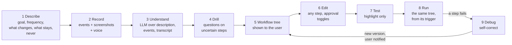
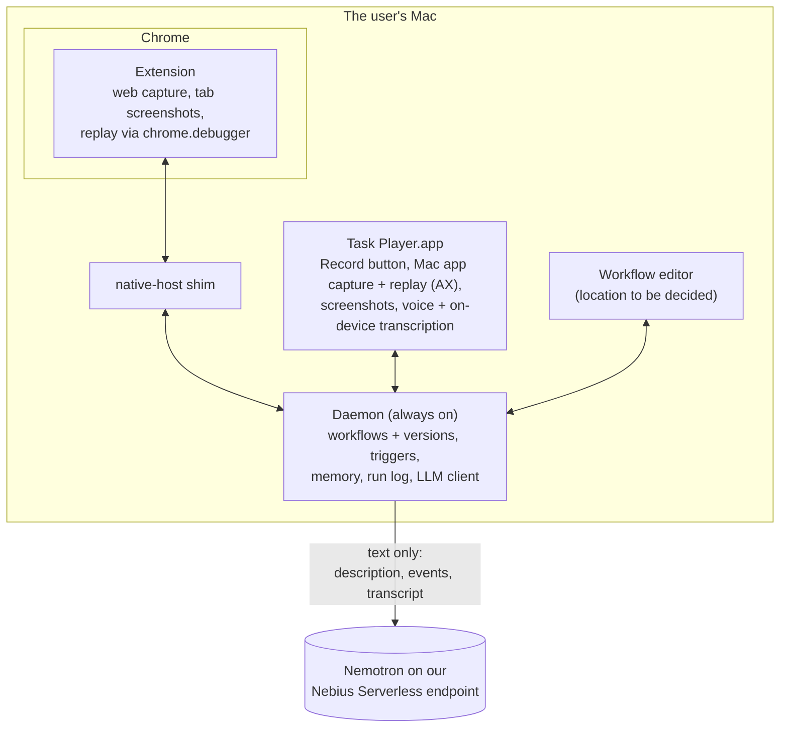

# Task Player Design

> **Updated Oct 8, 2026: the workflow pivot.** A task is now taught by **describing it and recording it** (with optional voice narration), turned into an **editable workflow tree** by an LLM, tested, and replayed with **self-correction**. This file is the source of truth. The earlier live design doc (Sep 30) describes the old flat-skill flow and is out of date. The code still implements that old flow: see [Status: design vs code](#status-design-vs-code).

Task Player learns a work task from a description and one demonstration, shows the user the workflow it understood, lets them correct it, and then runs it for them, fixing itself when a site changes.

## Why the pivot

Scoring real workflows ([examples.md](examples.md)) showed that a recording alone does not say **why**: which email, which values change, where a typed sentence came from, when a choice is a judgement call. A one-shot compile of clicks into a flat list of steps replays literal values and cannot express "for each" or "only if". So the user now tells us the why (description and voice), sees what we understood (the tree), and fixes it before anything runs.

## The flow



### 1. Describe

Before recording, the user fills in a short form. Each field has placeholder text that explains why it matters.

| Field | Input | Placeholder (shown to the user) | Used for |
| --- | --- | --- | --- |
| **Goal** | free text | "What is done when this task is done? e.g. *This week's revenue, signups and churn are in the KPI sheet*" | The workflow's intent; success checks |
| **Frequency** | dropdown | Proposed options: Only when I start it · Every hour · Every day at… · Weekdays at… · Every week on… at… · Every month on day… at… · When a file appears in a folder… | The workflow's trigger |
| **What changes each run** | free text, comma-separated | "e.g. *the email, the numbers, the week's date*" | Variables: values that must not be replayed literally |
| **What stays the same** | free text, comma-separated | "e.g. *the sender Reporting Bot, the KPI 2026 sheet, the column names*" | Constants the workflow may hard-code |
| **Never** (optional) | free text, comma-separated | "e.g. *send anything without asking, delete files*" | Guard rails: matching steps always need approval, or are refused |

### 2. Record

The user presses Record and does the task their usual way. Three streams are captured on one clock, so each piece lines up with the others by timestamp:

- **Events:** web clicks, typing, selects, files, drops, drags, copy and paste (extension); Mac app clicks, values, menus and shortcuts (Task Player.app, Accessibility API); file moves and renames (daemon, FSEvents). As today.
- **A screenshot at each event:**
    - **What:** only the active window, downscaled, with sensitive fields blacked out (password and payment fields in pages, secure text fields in Mac apps).
    - **Where it goes:** it stays on the Mac.
    - **Permission:** Mac app windows need macOS's **Screen Recording** permission. Chrome's visible tab can be captured by the extension without it.
- **Voice (optional):** the user can narrate while working ("I always take the newest one from Reporting Bot"). Audio is transcribed **on the Mac** and never leaves it; the transcript is split into timestamped segments aligned with the events.

### 3. Understand

An LLM reads the description, the event trace and the aligned transcript, plus memory of earlier answers. It produces a draft workflow tree. Its job is to turn behaviour into intent:

- a click on an email becomes "the newest email from Reporting Bot", using the description and the narration;
- values the description says change become variables, never literals;
- repeated actions become a loop, and "only if" in the narration becomes a branch;
- judgement and text work (summarise, classify, read a document) become LLM steps;
- anything still unclear is marked uncertain for the drill.

Whether screenshots are used here is an [open question](#open-questions): they stay on the Mac, and the model runs on our Nebius endpoint.

### 4. Drill

Questions go only to steps marked uncertain, shown on the draft tree ("Is this always the newest email, or a specific one?"). Answers update the tree and are saved to memory, so the same question is not asked again for this workflow or site.

### 5. The workflow tree

The finished workflow is shown to the user as a tree. Example, workflow 1 in [examples.md](examples.md):

```
Weekly KPI email → Sheet                          trigger: every week on Monday at 09:00
  variables: week_start = this Monday · kpis (from step 3)
  1  browser  open the Gmail inbox
  2  browser  open the newest email from "Reporting Bot" with "Weekly metrics" in the subject
  3  llm      read Revenue, Signups and Churn from the email body → kpis { revenue, signups, churn }
  4  browser  open the "KPI 2026" sheet
  5  browser  write week_start and kpis into the first empty row, by column header      [approval]
```

And one with a loop, a branch and an ask (workflow 2):

```
Vendor invoices → Xero                            trigger: every day at 10:00
  for each unread email labelled "Invoices"
    1  browser  download the PDF attachment
    2  llm      read vendor, invoice number, amount and due date from the PDF → invoice
    3  if invoice.amount > 5000
         ask     "Large invoice from {{invoice.vendor}}. Continue?"
    4  mac      rename it {{invoice.vendor}}-{{invoice.number}}-{{invoice.date}}.pdf, move to Invoices/{{month}}
    5  browser  create a bill in Xero with invoice's fields, attach the PDF                [approval]
    6  browser  label the email "Processed"
```

### 6. Edit

The user can edit any step (its target, values, wording), add, remove or reorder steps, and **toggle human approval** on any step. Steps that send, submit, pay, publish or delete start with approval on, and so do steps matching a "Never" entry.

### 7. Test

**Play** runs the tree instantly as a **highlight-only** replay: each step's target is found and highlighted, with nothing clicked, typed or sent. *Not final:* steps whose targets only appear after an earlier action (a page reached by clicking) cannot be highlighted without doing that action, so this mode will change.

### 8. Run

Runs execute **exactly the tree the user saw**, started by the trigger from Frequency or by hand. Action steps are deterministic: no model call unless an LLM step asks for one, or a step fails. The engine is the one already built (see [Replay engine](#replay-engine)).

### 9. Debug and self-correct

When a step fails after its retries (target not found, check not met), a **debug** step takes over:

1. The LLM gets the step's intent, the failure, the stored target, the current page or window outline, and the recent run log.
2. It proposes a correction: a new target, an extra step (dismiss a new banner), or a longer wait.
3. The player runs the corrected step. If its check passes, the run continues.
4. The corrected workflow is **saved as a new version automatically**. Every version is kept. The user is notified with what changed and a **single click rolls back** to the previous version.

Debug proposes; the player executes. Debug never adds a step that sends, submits, pays, publishes or deletes, and never changes a value the user set; those failures go to the user instead.

## The workflow format

The workflow replaces the flat skill as the contract between record and replay. It lives in `packages/core` (to be written; today's `skill.ts` is the old format). Everything a node can be:

| Node | What it does | Notes |
| --- | --- | --- |
| **action** | One step in the browser, a Mac app, files or a script | Today's `Step`: channel (`web`, `ax`, `fs`, `script`), action, target (a locator, never coordinates), args, checks |
| **llm** | Transforms data: summarise, classify, read text or a document, compute | **Transform only**: inputs are variables, output is typed (text, number, date, list, object) and saved to a variable. It never drives the UI and never chooses targets |
| **loop** | Runs its child steps for each item of a list variable | e.g. each email, row, file |
| **branch** | Runs one set of children if a condition holds, another otherwise | Conditions compare variables (equals, contains, greater than, exists); a fuzzy condition is computed by an llm node first |

**Variables** hold values that change between runs. They come from the description ("what changes each run"), the trigger (the file that appeared), an action step's result (`save_as`), an llm node's output, or the user.

**On every step:**

- **approval**: on or off, toggled in the editor;
- **ask** (optional): ask the user for a value or a confirmation before the step runs, e.g. "What are you working on today?" for a standup.

**On the workflow:** id, name, the description fields, the trigger (from Frequency), variables, the tree, and **version** history (who changed it: the user, the drill or debug, and a one-line summary of the change).

## Architecture



**Why a native host shim.** Chrome launches a fresh process for every native messaging connection, so it cannot attach to the always-on daemon. The shim (`apps/native-host`) is what Chrome launches; it forwards bytes to the daemon's Unix socket (`~/Library/Application Support/TaskPlayer/daemon.sock`, at most 103 bytes long, a macOS limit). Only the extension can open the connection, so it connects on startup and reconnects with `chrome.alarms`.

## Replay engine

Built and unchanged by the pivot; the workflow interpreter will call it for every action node.

- **Matching, never coordinates.** A stored target is found again on the live page by Chrome's own accessibility tree (role, with equivalent roles grouped, and accessible name), stored attributes and fallback selectors, weighted 0.45 / 0.25 / 0.30. One clear winner (score ≥ 0.5, margin 0.15 over the runner-up) is required; otherwise the step reports "not found" or "ambiguous" with the top candidates. Positions are read at the moment of acting.
- **Acting like a person.** Trusted CDP input: a mouse press at the element's current centre after checking nothing covers it; typing as keyDown/keyUp per character (inserting text at once leaves widgets such as date pickers with stale state). Uploads hand the file to the page's file input (in the target, its dialog, the page or a shadow root) or drop it, with no native dialog.
- **Waiting.** Navigation waits until the document is parsed; each step then waits for its own target and checks its result.
- **Where it runs.** Web steps run in a dedicated, unfocused 1280×800 Chrome window through `chrome.debugger`; Mac app steps through Task Player.app; files and scripts in the daemon. `pnpm replay` runs the same code in a separate debug-port Chrome for development.
- **Run log.** Every run records each step, its match score, result, retries and (new) the workflow version that ran.

## Memory

Local SQLite in the daemon: facts and preferences from drill answers, run context, and site notes from debug fixes. The understanding step and debug read it. Users can view and delete entries. It never stores secrets.

## Safety and privacy

- **Stays on the Mac:** audio, screenshots, workflows, versions, memory, traces and run logs.
- **Sent to our Nemotron endpoint:** text only. That means the description, the event trace (without input values from sensitive fields), the transcript, and for debug the failing step and a page outline. No third-party model API.
- **Sensitive fields:** blacked out in screenshots, and their values never recorded; passwords become secret inputs read from the macOS Keychain at run time.
- **LLM nodes cannot act.** They only transform data, so text on a web page cannot make the model click, send or navigate.
- **Approvals:** on by default for send, submit, pay, publish and delete, and for anything matching the description's "Never".
- **Debug is bounded:** it cannot add outward actions or change user-set values; every change is a new version the user can roll back in one click.
- **Permissions (macOS):** Accessibility (Mac app capture and replay), Screen Recording (Mac app window screenshots), Microphone (narration), Automation (scripts), Full Disk Access not needed.

## Status: design vs code

The code implements the earlier flow: record, then compile once into a **flat skill** (`packages/core/src/skill.ts`), then replay. Mapping to the new design:

| Part | In the code today | For the new design |
| --- | --- | --- |
| Web, Mac app and file capture | ✅ extension, Task Player.app, daemon file watcher | Stays |
| Replay engine (matching, acting, waiting) | ✅ `packages/player`, extension, Task Player.app | Stays; called by the new interpreter |
| Approvals, run log, memory, IPC, native host | ✅ | Stays; run log adds the version |
| `data.pick` (rules over rows), `data.ai` (capped model call) | ✅ | `data.ai` becomes the **llm** node; `data.pick` stays as a data action |
| Skill format | Flat list of steps | **Workflow tree**: variables, loop, branch, llm, ask, approval, versions |
| Compile | Trace → skill, drill in the terminal | Description + trace + transcript → tree; drill on the tree |
| Description form | ❌ | New |
| Screenshots per event | ❌ (only cropped element images in web capture) | New |
| Voice + on-device transcription | ❌ | New |
| Workflow editor | ❌ (terminal only) | New |
| Highlight-only test | ❌ | New |
| Debug + self-correct + versions + rollback | ❌ (fallback is a TODO in `run.ts`) | New |
| Triggers from Frequency | ❌ (only manual `run`) | New |

## Build order

Replay side first: the workflow format and its interpreter are what everything else produces or runs. Deadline: **October 30, 2026**.

| # | Milestone | Owner | Done when |
| --- | --- | --- | --- |
| 1 | Workflow format in `packages/core`: nodes, variables, ask, approval, versions | Both | Schema merged; `skills/real` rewritten as workflows and validated |
| 2 | Interpreter: variables, loop, branch, llm node, ask, approval | Replay | A hand-written workflow with a loop and a branch runs end to end |
| 3 | Debug and self-correct, versions, notification and rollback | Replay | A drifted page is fixed, saved as v2, and rolled back in one click |
| 4 | Highlight-only test | Replay | Play highlights each reachable target without acting |
| 5 | Triggers from Frequency | Replay | A scheduled and a folder workflow start on their own |
| 6 | Description form, screenshots, voice and transcription | Record | A recording carries all three streams on one clock |
| 7 | Understand → tree, drill on the tree | Record | Workflow 1 in examples.md becomes a correct tree from a real recording |
| 8 | Workflow editor | Both | Edit a step, toggle approval, play, see versions |
| 9 | Measure coverage on examples.md; demo video; submission | Both | Submitted |

## Glossary

| Term | Meaning |
| --- | --- |
| Workflow | A taught task: description, trigger, variables and a tree of steps, with versions |
| Node | One item in the tree: action, llm, loop or branch |
| Variable | A value that changes between runs, filled at run time |
| Transcript | The narration, transcribed on the Mac and split into timestamped segments |
| Drill | Questions on the uncertain parts of a draft workflow |
| Highlight-only test | A replay that finds and highlights each target without acting |
| Debug step | The LLM-assisted fix when a step fails; saves a new version |
| Locator | How a control is remembered: role, accessible name, nearby text, attributes and fallback selectors. Never coordinates |
| CDP / chrome.debugger | Chrome's remote-control protocol, reached by the extension in the user's own Chrome |
| AX | macOS Accessibility API, for reading and pressing controls in Mac apps |
| Native host shim | The program Chrome launches for native messaging; forwards bytes to the daemon |
| Nemotron / Nebius Serverless | NVIDIA's open models, served from our own Nebius endpoint |

## Hackathon fit

Personal AI track of the [Nebius x NVIDIA Global AI Hackathon](https://nebiusglobalaihackathon.devpost.com/).

| Track requirement | Where we meet it |
| --- | --- |
| Always-on | Daemon with triggers from Frequency |
| Private, data under user control | Audio, screenshots, workflows and logs stay on the Mac; text-only calls to our own Nemotron endpoint |
| Persistent memory | Drill answers, site notes from debug, run context |
| Reusable skills | Workflows, with versions improved by debug |
| Tools across daily workflows | Browser, Mac apps, files, scripts |
| At least one NVIDIA open model | Nemotron for understanding, llm nodes and debug; an NVIDIA speech model is a candidate for on-device transcription |

Submission also needs the public MIT repo, README setup, a demo video of 3 minutes or less and a working demo URL.

## Open questions

- [ ] **Screenshots and the model.** Screenshots stay on the Mac, but the understanding and debug steps run on our Nebius endpoint. Options: use screenshots only on the Mac (in the editor, for the user), add a local vision model, or send selected frames with the user's consent.
- [ ] **Frequency options.** The dropdown list above is a proposal; "when an email arrives" is wanted but needs an email trigger.
- [ ] **Where the workflow editor lives:** Chrome side panel, a local page served by the daemon, or Task Player.app.
- [ ] **On-device transcription model:** an NVIDIA speech model (Parakeet / Canary) if it runs well on Apple silicon, otherwise macOS's built-in speech recognition.
- [ ] **Highlight-only test** for steps behind an earlier action (see [Test](#7-test)).
- [ ] **Debug limits:** attempts per run, model budget, which fixes are allowed without the user.
- [ ] **Sheet writes and clipboard steps**, needed by several workflows in examples.md.
- [ ] **Demo URL** for a Chrome extension + Mac app; ask the organisers.
- [ ] Which Nemotron model for understanding, llm nodes and debug.
