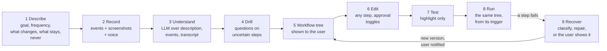
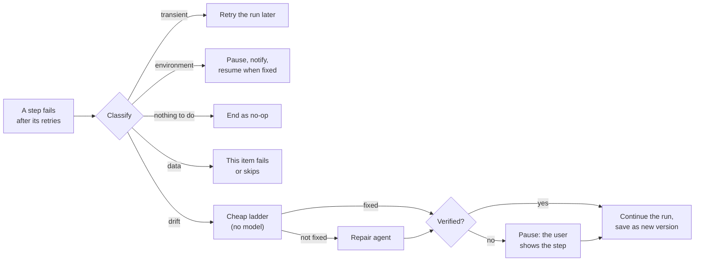
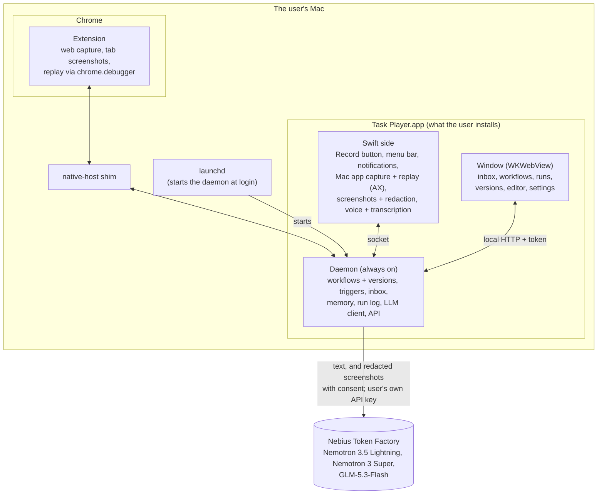

# Task Player Design

> **Updated Oct 8, 2026: the workflow pivot.** A task is now taught by **describing it and recording it** (with optional voice narration), turned into an **editable workflow tree** by an LLM, tested, and replayed with **self-correction**. This file is the source of truth. The earlier live design doc (Sep 30) describes the old flat-skill flow and is out of date. The skill format is migrated (Oct 8); most of the rest of the flow is not built yet: see [Status: design vs code](#status-design-vs-code).

Task Player learns a work task from a description and one demonstration, shows the user the workflow it understood, lets them correct it, and then runs it for them, fixing itself when a site changes.

## Why the pivot

Scoring real workflows ([examples.md](examples.md)) showed that a recording alone does not say **why**: which email, which values change, where a typed sentence came from, when a choice is a judgement call. A one-shot compile of clicks into a flat list of steps replays literal values and cannot express "for each" or "only if". So the user now tells us the why (description and voice), sees what we understood (the tree), and fixes it before anything runs.

## The flow



### 1. Describe

Before recording, the user fills in a short form. Each field has placeholder text that explains why it matters.

| Field | Input | Placeholder (shown to the user) | Used for |
| --- | --- | --- | --- |
| **Goal** | free text | "What is done when this task is done? e.g. *This week's revenue, signups and churn are in the KPI sheet*" | The workflow's intent; success checks |
| **Frequency** | dropdown | Proposed options: Only when I start it · Every hour · Every day at… · Weekdays at… · Every week on… at… · Every month on day… at… · When a file appears in a folder… | The workflow's trigger |
| **What changes each run** | free text, comma-separated | "e.g. *the email, the numbers, the week's date*" | Variables: values that must not be replayed literally |
| **What stays the same** | free text, comma-separated | "e.g. *the sender Reporting Bot, the KPI 2026 sheet, the column names*" | Constants the workflow may hard-code |
| **Never** (optional) | free text, comma-separated | "e.g. *send anything without asking, delete files*" | Guard rails: matching steps always need approval, or are refused |

### 2. Record

The user presses Record and does the task their usual way. Three streams are captured on one clock, so each piece lines up with the others by timestamp:

- **Events:** web clicks, typing, selects, files, drops, drags, copy and paste (extension); Mac app clicks, values, menus and shortcuts (Task Player.app, Accessibility API); file moves and renames (daemon, FSEvents). As today.
- **A screenshot at each event** (only with the user's **screen** consent): only the active window, with sensitive information blacked out before it is stored (see [Consent, redaction and retention](#consent-redaction-and-retention)). Mac app windows need macOS's **Screen Recording** permission; Chrome's visible tab is captured by the extension without it.
- **Voice** (optional, only with the user's **microphone** consent): the user can narrate while working ("I always take the newest one from Reporting Bot"). macOS's built-in speech recognizer (**SpeechAnalyzer**, macOS 26) transcribes it on the Mac with word timestamps; the transcript is split into segments aligned with the events. The audio itself is never sent anywhere; the transcript text is.

Without consent, recording still works from events alone.

### 3. Understand

The **design agent** ([Agents](#agents); Nemotron 3 Super, the `smart` profile) reads the description, the event trace, the aligned transcript and memory of earlier answers. With screen consent it can have redacted screenshots around events the trace alone cannot explain described by GLM-5.3-Flash (the `vision` profile), as text. The result is a draft workflow tree. Its job is to turn behaviour into intent:

- a click on an email becomes "the newest email from Reporting Bot", using the description and the narration;
- values the description says change become variables, never literals;
- repeated actions become a loop, and "only if" in the narration becomes a branch;
- judgement and text work (summarise, classify, read a document) become LLM steps;
- anything still unclear is marked uncertain for the drill.

When the skill is finalised, the recording's raw files are scheduled for deletion ([retention](#retention)).

### 4. Drill

Questions go only to steps marked uncertain, shown on the draft tree ("Is this always the newest email, or a specific one?"). Answers update the tree and are saved to memory, so the same question is not asked again for this workflow or site.

### 5. The workflow tree

The finished workflow is shown to the user as a tree. Example, workflow 1 in [examples.md](examples.md):

```
Weekly KPI email → Sheet                          trigger: every week on Monday at 09:00
  variables: week_start = this Monday · kpis (from step 3)
  1  browser  open the Gmail inbox
  2  browser  open the newest email from "Reporting Bot" with "Weekly metrics" in the subject
  3  llm      read Revenue, Signups and Churn from the email body → kpis { revenue, signups, churn }
  4  browser  open the "KPI 2026" sheet
  5  browser  write week_start and kpis into the first empty row, by column header      [approval]
```

And one with a loop, a branch and an ask (workflow 2):

```
Vendor invoices → Xero                            trigger: every day at 10:00
  for each unread email labelled "Invoices"
    1  browser  download the PDF attachment
    2  llm      read vendor, invoice number, amount and due date from the PDF → invoice
    3  if invoice.amount > 5000
         ask     "Large invoice from {{invoice.vendor}}. Continue?"
    4  mac      rename it {{invoice.vendor}}-{{invoice.number}}-{{invoice.date}}.pdf, move to Invoices/{{month}}
    5  browser  create a bill in Xero with invoice's fields, attach the PDF                [approval]
    6  browser  label the email "Processed"
```

### 6. Edit

In the app's window ([The app](#the-app)), the user can edit any step (its target, values, wording), add, remove or reorder steps, and **toggle human approval** on any step. Steps that send, submit, pay, publish or delete start with approval on, and so do steps matching a "Never" entry.

### 7. Test

**Play** runs the tree instantly as a **highlight-only** replay: each step's target is found and highlighted, with nothing clicked, typed or sent. *Not final:* steps whose targets only appear after an earlier action (a page reached by clicking) cannot be highlighted without doing that action, so this mode will change.

### 8. Run

Runs execute **exactly the tree the user saw**, started by the trigger from Frequency or by hand. Action steps are deterministic: no model call unless an LLM step asks for one, or a step fails. The engine is the one already built (see [Replay engine](#replay-engine)).

### 9. Recover from a failure

*Decided Oct 9, 2026.* The aim is **as little human intervention as possible without giving up safety**. Two rules shape everything below: a run that silently does the wrong thing is worse than one that stops, and only a real change in the site or app may change the workflow.



#### Classify first

When a step fails after its retries, the failure is classified **before anything is changed**:

| Class | Examples | What happens | New version? |
| --- | --- | --- | --- |
| **Transient** | site down, 5xx, timeout, no network | The run is retried later with backoff; after the last retry it is handled as *environment* | No |
| **Environment** | logged out, a one-time code, Task Player.app not running, a macOS permission missing | The run **pauses** and the user is told exactly what is needed ("log in to Xero"); it resumes from the failed step when they are done | No |
| **Nothing to do** | the email hasn't arrived, the folder is empty, no unread invoices | The run ends as **no-op**, which is not a failure | No |
| **Data** | this invoice has no due date, an extracted value doesn't fit its type | This item fails (or is skipped, with `on_item_fail: "skip"`); outside a loop the run fails and the user is told | No |
| **Drift** | a button renamed, a new banner or dialog, an action moved into a menu, a new confirmation page, a changed layout | **Repair** (below) | Yes |

Cheap signals decide first, with no model: the HTTP status, a URL that is a login page, the channel's own errors (app not running, permission missing). When these don't decide, the **repair agent** classifies the failure as its first job, and ends with `resolve` (any class but drift) or goes on to repair.

#### Repair

1. **Cheap ladder, no model.** Wait longer; match with the locator's label and nearby heading; fuzzy match (same role, similar name, one clear winner). Most drift should stop here.
2. **The repair agent** ([Agents](#agents)): a model in a loop with tools, because a fix may need looking, acting and looking again (open the "⋯" menu, then see what is inside), and may take several tries. It starts from the **failure report**:
   - the workflow's goal and the failed step's intent;
   - the failure, the stored target and its top candidates *described* (role, name, text, attributes; not only scores);
   - an outline of the current page, built from the DOM so that hidden file inputs are listed, or of the Mac window from the Accessibility tree;
   - the recent run log, and site notes from memory;
   - and can ask for more: find and inspect elements, probe the page safely, have a redacted screenshot described (with screen consent), try its draft on the live page.
3. **Scope: the whole workflow, not one step.** Repair may retarget steps, add, remove, reorder or replace steps (open a "⋯" menu, pass a new confirmation page, dismiss a banner), and change waits and timeouts, anywhere in the tree. A changed workflow must parse and pass `check.ts`, like any other.

**What repair may never do** (a repair that needs one of these goes to the user):

- **Outward actions:** add a step that sends, submits, pays, publishes or deletes, or one that matches a **Never** entry. It may retarget an existing outward step to the same control on a changed page ("Submit" → "Submit invoice"), but that step then needs approval the first time it runs. One exception, for a new confirmation page: a step that *finishes* an outward step it directly follows ("Confirm" after "Submit") may be added, and it always needs approval.
- **What the user decided:** the trigger, the inputs and their defaults, the description, values the user set in `args`, llm step instructions, `max_items` and `on_item_fail`.
- **Safety switches:** turn approval off on any step, or remove an `ask`.
- **Reach:** add `script` steps, or navigate to a site the workflow doesn't already use.

#### Verify

A repair counts only with evidence: the repaired step's `check` passes, or, if it has none, the next step's target is found (or its `wait` holds), or for the last step the workflow's `success` checks pass. A click that simply didn't throw is not evidence. Steps repaired further down the tree are verified when the run reaches them, and fail like any other step if they don't hold.

#### Save permanently

A verified repair **becomes the next version immediately**; later runs use it, with no confirmation step. The version's history note says `by: debug`, with what changed and why. The user is notified with the change, and **a single click rolls back** to the previous version. What was learnt about the site ("the billing portal shows a cookie banner first") is saved to memory as a site note, which later repairs read.

#### When repair can't fix it: pause, and the user shows it

- The run **pauses** instead of failing. The browser tab or Mac window, and the run's variables, are kept as they are, and the user is notified with where it stopped and why.
- The user **does the stuck part by hand while Task Player records**, with the same recorder used to teach the task. *(Built so far, Oct 10: the user does it by hand in the automation window and types `skip`; the run goes on after the step. Recording the demonstration into steps comes with the record side.)*
- That demonstration **becomes the repair**: it is turned into steps at the failed point, checked like any other recorded steps (approvals on for outward steps), and saved as the next version (`by: user`).
- The run **resumes** after the demonstrated part.

So asking the user is not a dead end: it is how a fix the model couldn't find is taught, once.

#### Limits

One repair episode per failed step and at most two per run; per episode at most 12 turns, $0.10 and 20 actions on the live page; per run at most $0.25 of repair (`DEFAULT_REPAIR_LIMITS` in `packages/player/src/repair/repair.ts`; to move to `config.json`). A transient failure is retried after 30 s and 2 min, then handled as environment. An episode that runs out ends as `escalate`: the run pauses for the user. How long a paused run waits before it ends is [still open](#open-questions).

## Agents

Understanding a recording and recovering from a failure both need looking, acting, checking the result and trying again, with a memory of what was already tried. So both are **agents**: a model in a loop with tools. One runtime, two agents:

| Agent | Lives in | Job | Ends with |
| --- | --- | --- | --- |
| **Repair agent** | `packages/player/src/repair/` | Work out why a step failed and get the run going again safely ([section 9](#9-recover-from-a-failure)) | `resolve`, `commit` or `escalate` |
| **Design agent** | `packages/recorder/src/design/` (record side) | Turn a description, a recording and its transcript into a workflow; the drill is one of its tools | `finish` (and `ask_user` along the way) |

### Layers

```
  player                                     recorder
   · llm steps ─── one call ──┐               · design agent ──┐
   · repair agent ──┐         │                                │
                    ▼         │                                ▼
  packages/agent   loop · tools · guard · budgets · working memory · transcript · protocol
                    │         │
                    ▼         ▼
  packages/llm     Token Factory client · profiles · structured output · thinking · images · usage · fake
```

A caller that needs one model call (an llm step in a workflow) calls `packages/llm` directly; a caller that needs a loop builds an agent on `packages/agent`. Dependencies point one way: `core` ← `llm` ← `agent` ← `player` / `recorder` ← `daemon`. `llm` and `agent` know nothing about skills; everything about steps, variables and policy lives in `core`, `player` and `recorder`.

### The runtime (`packages/agent`)

| Part | What it does |
| --- | --- |
| **Tools** | `{ name, kind, description, input (zod), run(input, ctx) }`, where kind is look, probe, edit, try or finish. Tools are written against interfaces ("look at the page", "act on the page", "run steps"); the daemon connects them to the extension, Task Player.app, memory and the skill store, so agents also run in tests without Chrome |
| **The loop** | Briefing and task in; the model picks one tool; the **guard** allows or refuses it; the result goes back into working memory; until a `finish` tool or the budget ends it |
| **Guard** | A function each agent supplies. A refusal is returned to the model as a result, never a crash |
| **Budgets** | Turns, dollars (from `llm`'s usage meter), live actions, time. Running out ends the episode cleanly |
| **Working memory** | The episode's turns; large old observations (page outlines) are condensed as turns pile up |
| **Protocol** | Native tool calling, or one schema-checked JSON action per turn; whichever `pnpm llm:check` shows Nemotron does reliably on Token Factory |
| **Transcript** | Every turn as a structured event, stored by the caller |

**Our own loop, no framework.** The loop is small; what matters is product-specific: the guard on targets and edits, budgets in dollars and live actions, Nemotron's thinking control and the JSON-action fallback, the transcript in our run log, pausing the *run* (not the agent), and no third-party telemetry. Frameworks (Vercel AI SDK, OpenAI Agents SDK, LangGraph.js, Mastra) would wrap or get in the way of each. The runtime sits behind a small interface (next action from state), so adopting one later stays cheap.

### What an agent knows it can do

- **A capability briefing, generated from code** (`packages/core/src/briefing.ts`), opens every episode: the actions per channel with their args, the variable types and reference rules, and what is available right now (extension connected, Task Player.app running, consents given). When the code changes, the briefing does.
- **The tools are the rules.** Every workflow edit is a typed operation checked by the schema and `check.ts`; an impossible edit comes back as an error the agent reads (`{{pdf.pth}} has no such field: pdf is a file`).
- **What may never change is enforced in code**, not in the prompt: the draft is compared with the original against [section 9's list](#repair) (`packages/core/src/guard.ts`).

### Memory

| Layer | Holds | Lives |
| --- | --- | --- |
| **Working memory** | This episode: what was looked at, changed, tried, and what happened | In the loop |
| **Episode record** | The whole transcript: tool calls, results, cost, the final patch | With the run log; the editor shows it as "what Task Player did to fix this", and it explains a rollback |
| **Workflow history** | Earlier versions with their `by: debug` / `by: user` notes | The skill store |
| **Long-term memory** | Site notes ("the billing portal shows a cookie banner first"), earlier fixes per site, drill answers | SQLite memory, recalled at the start of an episode and written by a `note` tool |

### The failure report

Collected before the repair agent's first turn, so it starts from evidence: the step's result (error, failed check, retries, top candidates *described*); the page or window (URL, title, an outline built from the DOM with hidden inputs, open dialogs; or the Accessibility tree); browser signals (HTTP statuses, failed requests, console errors, from CDP's Network and Runtime events); Mac signals (app not running, a missing permission, file errors); the run so far (position, variables, the last steps' results); and what changed since the workflow last worked (a target that matched at 1.0 now matches at 0.4).

### The repair agent's tools

| Kind | Tools | Guard |
| --- | --- | --- |
| **Look** | `failure_report`, `page_outline(scope)`, `find(text, role)`, `inspect(candidate)`, `describe_screen` (vision profile, screen consent), `run_log`, `workflow(view)`, `recall(query)` | Read-only |
| **Probe the live page** | `open_menu`, `click_safe`, `dismiss`, `scroll`, `press`, `wait`, `go_back`, `navigate` (same site) | The code checks the **target**: nothing that sends, submits, pays, publishes or deletes; nothing matching **Never**; no other site |
| **Edit the draft** | `retarget`, `insert_step`, `replace_step`, `remove_step`, `move_step`, `set_field` (waits, timeouts, checks) | The schema, `check.ts` and section 9's "never" rules on every edit |
| **Try** | `try_steps(from, count)`: runs the draft on the live page with the real player, approvals forced on for outward steps | How a fix is tested and refined inside the loop |
| **Finish** | `resolve(class, reason)` · `commit(summary)`, allowed only after `try_steps` showed the evidence [Verify](#verify) asks for · `escalate(reason, what_to_show)` | Exactly one ends the episode |
| **Remember** | `note(site fact)` | Saved with the skill and site |

Page content is **untrusted data**: tool results are marked as such, and since the guard refuses outward actions, a page that says "click Delete" cannot widen what the agent may do.

**The design agent** uses the same runtime with its own tools: `read_trace`, `read_transcript`, `describe_screen`, `read_description`, `recall`, the same edit operations plus `add_loop`, `add_branch` and `add_llm_step`, `validate`, a highlight-only `dry_run`, `ask_user` (the drill) and `finish(workflow)`.

### Edit operations, shared by agents and people

Workflow edits are pure operations on the step tree in `packages/core/src/edit.ts`: used by the repair agent, the design agent and the **workflow editor**, so a person's edit and an agent's edit are the same thing, checked the same way. A version's history records its operations, which makes "what changed" and one-click rollback simple.

### Plugging into a run

1. The interpreter reaches a step that failed every retry and **pauses** the run, keeping the tab or window, the variables and the position (`l1[2] > s3`).
2. The daemon starts a repair episode on that paused state.
3. `commit` saves the next version and the run **resumes from the same position** on it (step ids stay stable; the interpreter gains a "resume from" mode). `resolve` retries later, waits for the user, or ends as no-op or data failure. `escalate` pauses for the user to show the fix.

### Testing

- **Runtime:** a scripted fake model; tests for the loop, guard refusals and budgets, with no network.
- **Repair scenarios:** fixture pages for each kind of failure (a renamed button, a new banner, an action moved into a "⋯" menu, a new confirmation page, a logged-out page, an empty inbox), each with its expected outcome.
- **Real model, on demand:** the same scenarios on Nemotron, measuring fix rate, **wrong fixes** (verified but wrong), turns and cost per fix. These feed the coverage in [examples.md](examples.md).

## The workflow format

The skill is the contract between record and replay, and a skill **is** a workflow. Source of truth: `packages/core/src/skill.ts` (the schema and the args of every action), `vars.ts` (types and references) and `check.ts` (the variable check). The workflow replay receives is final: the drill happened at record time.

**On the skill:** `id`, `name` (short, for lists and notifications), `version`, `description` `{ goal, changes[], constants[], never[] }` (the form), `steps` (the tree), `success` (final checks) and `history` (one note per version: `by` record, user or debug, a summary and a time).

**The first step is always the trigger:** `{ id, type: "trigger", intent, when, inputs }`. `when` is the Frequency (`manual`, `schedule` with a cron, `folder_watch`); `inputs` are the values a run starts with, each `{ type, description?, default?, resolve?, example? }`. A value given with `run`, a file resolver ("the newest PDF in ~/Downloads"), or the default fills it; `example` is what was seen while recording.

**Every other step** has `id` (unique across the tree), `type`, `intent` (what it is for: the editor shows it, the agents rely on it), `requires_approval` and an optional `ask` (`{ question, kind: "value" | "confirm", output }`, asked before the step runs). Then by type:

| `type` | What it does | Fields |
| --- | --- | --- |
| `action` | One step in the browser, a Mac app, files or a script | `channel` (`web`, `ax`, `fs`, `script`, `data`), `action`, `target` (a locator, never coordinates), `args`, `wait`, `check`, `output`, `timeout_ms`, `on_fail` |
| `llm` | **Transform only**: summarise, classify, read text, compute. Never drives the UI, gets no tools | `instruction`, `inputs` (references to the data it reads), `output` (required; never a file or secret). The model's answer is checked against the output's type |
| `control`, `kind: "loop"` | Runs its `steps` for each item of a list | `over` (a reference to a list), `item` (the current item, a variable visible only inside the loop), `max_items` (100), `on_item_fail` (`stop` or `skip`), `steps` |
| `control`, `kind: "branch"` | Runs its `steps` if a condition holds, its `else` steps otherwise | `if` (a comparison `{ left, op, right }` with `equals`, `not_equals`, `contains`, `greater_than`, `less_than`, `exists`, `not_exists`; or `all` / `any` / `not` of conditions), `steps`, `else`. No `then` key: an object with one is treated as a promise by `await` |

### Variables

Every value a step reads is a **variable declared, with its type, by an earlier step**: the trigger's `inputs`, an action's or llm step's `output` (`{ name, type }`), an ask's `output`, or a loop's `item`. Names are unique in a skill, and each variable is set by exactly one step.

**Types** (a fixed set, one way to write each):

| Type | Value |
| --- | --- |
| `{ "type": "text" }` | a string |
| `{ "type": "number" }` | a number |
| `{ "type": "boolean" }` | true or false |
| `{ "type": "date" }` | `"YYYY-MM-DD"` |
| `{ "type": "file" }` | `{ path, name, size, modified }`: `{{invoice_file.path}}`, `{{invoice_file.name}}` are ordinary fields |
| `{ "type": "secret" }` | text that is never logged, stored or sent to the model |
| `{ "type": "list", "items": <type> }` | a list of one type |
| `{ "type": "object", "fields": { name: <type> } }` | an object; without `fields`, rows of any shape (a sheet read by its header) |

**References:** `{{name}}`, then `.field` for an object's field and `.N` for a list item: `{{invoice.amount}}`, `{{emails.0.subject}}`, `{{email.body}}` (inside a loop); `{{today}}` is built in. A string that is exactly one reference keeps the value's type (a list stays a list); inside longer text the value becomes text, objects and lists as JSON. A file value can be given wherever a path is expected.

**Visibility:** a reference is valid only after the step that declares the variable, at the same level or an enclosing one. A loop's item and anything produced inside the loop exist only inside it. A variable produced inside a branch exists after it only if both arms produce it with the same type.

**What each action produces** (and so the outputs it may declare): `web.extract` gives text, a list of text (`all`), or a list of row objects (`source`); `fs.find` a file, or a list of files (`pick: "all"`); `fs.move` and `fs.copy` a file or a list of files; `fs.rename` and `fs.write` a file; `fs.read` text; `data.pick` text (with `column`) or a row object; `script` steps text. Other actions produce nothing, and declaring an output on them is an error. Text may be declared as number, boolean or date and is converted at run time ("1,234" becomes 1234).

**Checked twice.** When a skill is parsed (saved by the recorder, the editor or the repair agent), `check.ts` verifies every reference: the variable is declared and visible at that step, the field exists, a loop runs over a list whose items match its `item`, names are unique, and each output fits what its action produces. Errors name the exact place, e.g. `steps.2.steps.3.args.from: {{pdf.pth}} has no such field: pdf is a file`. At run time, a step whose reference has no value stops with that name, and every output is checked against its declared type before it is saved.

## Architecture



The daemon is the hub, reached through three doors because each side allows a different one: Chrome only through native messaging (the shim), the Swift side through the Unix socket, the window through local HTTP ([The daemon as a service](#the-daemon-as-a-service)).

There is **no backend server**: the daemon is the backend. It runs on the user's Mac and calls Token Factory directly with the user's own API key. The extension, the Swift side and the window never call a model; everything goes through the daemon ([Deployment](#deployment)).

**Why a native host shim.** Chrome launches a fresh process for every native messaging connection, so it cannot attach to the always-on daemon. The shim (`apps/native-host`) is what Chrome launches; it forwards bytes to the daemon's Unix socket (`~/Library/Application Support/TaskPlayer/daemon.sock`, at most 103 bytes long, a macOS limit). Only the extension can open the connection, so it connects on startup and reconnects with `chrome.alarms`.

## Replay engine

Built and unchanged by the pivot; the workflow interpreter will call it for every action node.

- **Matching, never coordinates.** A stored target is found again on the live page by Chrome's own accessibility tree (role, with equivalent roles grouped, and accessible name), stored attributes and fallback selectors, weighted 0.45 / 0.25 / 0.30. One clear winner (score ≥ 0.5, margin 0.15 over the runner-up) is required; otherwise the step reports "not found" or "ambiguous" with the top candidates. Positions are read at the moment of acting.
- **Acting like a person.** Trusted CDP input: a mouse press at the element's current centre after checking nothing covers it; typing as keyDown/keyUp per character (inserting text at once leaves widgets such as date pickers with stale state). Uploads hand the file to the page's file input (in the target, its dialog, the page or a shadow root) or drop it, with no native dialog.
- **Waiting.** Navigation waits until the document is parsed; each step then waits for its own target and checks its result.
- **Where it runs.** Web steps run in a dedicated, unfocused 1280×800 Chrome window through `chrome.debugger`; Mac app steps through Task Player.app; files and scripts in the daemon. `pnpm replay` runs the same code in a separate debug-port Chrome for development.
- **The interpreter.** Walks the tree in order. A loop resolves `over`, refuses more than `max_items`, gives each item its own scope (the item and whatever its steps produce, dropped afterwards), and on a failing item stops or, with `on_item_fail: "skip"`, logs it and goes on; a denial always stops. A branch evaluates its condition (numbers written as text compare as numbers, ISO dates as dates, a reference with no value counts as missing for `exists`), runs one arm in its own scope and keeps only the variables both arms produce. An `ask` runs before its step: a value answer is converted to the output's type, a "no" to a confirm skips the step, and with no way to ask the run stops rather than guess. Approval on a loop is asked once; on a step inside it, once per item.
- **Run log.** Every run records each step with where it ran (`l1[2] > s3`: step s3 on the third item of loop l1), its match score, result and retries, plus loop items, branch choices, asks and skipped steps; its first line names the skill version that ran.

## Memory

Local SQLite in the daemon: facts and preferences from drill answers, run context, and site notes from repairs. The design agent and the repair agent read it ([Agents](#agents)). Users can view and delete entries. It never stores secrets.

## Models

All model calls go to **Nebius Token Factory** (OpenAI-compatible API, `https://api.tokenfactory.nebius.com/v1/`) through `packages/llm`, the layer under everything that uses a model. It knows nothing about skills: callers pick a **profile**, and what the call is for lives in the caller (an llm step, or an [agent](#agents)).

| Profile | Model (Token Factory id) | Used by | Price per 1M tokens (in / out) | Defaults |
| --- | --- | --- | --- | --- |
| `fast` | NVIDIA Nemotron 3.5 Lightning (`nvidia/Nemotron-3_5-Lightning`): 30B MoE, 3B active, 1M context | `llm` steps on every run | $0.06 / $0.24 | Thinking **off** |
| `smart` | NVIDIA Nemotron 3 Super (`nvidia/nemotron-3-super-120b-a12b`): 120B MoE, 12B active, 256K context | The repair agent and the design agent | $0.30 / $0.90 | Small thinking budget |
| `vision` | GLM-5.3-Flash (`zai-org/GLM-5.3-Flash`), the cheapest vision model on Token Factory | The agents' `describe_screen` tool | $0.15 / $0.50 | Only with screen consent |

Prices are from Token Factory's catalog (Oct 8, 2026) and live in config, not code; each profile's model can be swapped there. Rough costs: an `llm` step (2k tokens in, 200 out) about $0.0002; a repair turn (15k in, 1k out) about $0.005, so a repair episode is a few cents.

**What `packages/llm` does for every call:**

- **Thinking control.** Nemotron reasons by default on Token Factory, and reasoning shares `max_tokens` with the answer: left on, it can use up the whole budget and return nothing. Each role sets `chat_template_kwargs.enable_thinking` and a thinking budget explicitly; `<think>` blocks are stripped.
- **Structured output.** A zod schema is sent as `response_format: { type: "json_schema" }` **and** in the prompt (Nebius recommends both), the reply is validated, and on failure the call is retried once with the validation errors. If a model rejects `json_schema`, it falls back to `json_object`, then to plain text with JSON extraction.
- **Model catalog.** Each model's id, prices and what it supports (vision, `json_schema`, tool calling, thinking control); an image sent to a text-only model is refused.
- **Tools.** Tool definitions in, tool calls out, for agents.
- **Usage and cost.** Every call returns input and output tokens, an estimated cost, the model and its time. A usage meter adds them up per scope (a run, an episode); limits are the caller's: `llm` steps cap calls per run and cache answers by the run's date, instruction and data (in the player), agents have their budgets (in the runtime).
- **Reliability.** Timeouts; retry with backoff on 429 and 5xx; an abort signal.
- **Images only with consent,** and only after redaction ([below](#consent-redaction-and-retention)).
- **Testing.** A scripted fake client for unit tests. `pnpm llm:check` lists the models the key can reach, sends one small call per profile, and reports whether each supports `json_schema` and tool calling.
- **Config passed in.** Base URL, key and models come from the caller; the daemon builds them from the Keychain and `config.json` (`.env` only in development).

**The API key** is the user's own Token Factory key, stored in the **macOS Keychain** (`.env` only for development). The base URL is configurable, so a pass-through gateway could be put in front later without code changes.

**Token Factory account setting:** turn on **Zero Data Retention** at the organization level. By default Nebius keeps prompts and responses to speed up inference; with it on, nothing is stored after a request and nothing is used for training.

## Consent, redaction and retention

### Consent

Before the first recording, the user is asked two separate questions, explained in plain words:

- **Screen:** "Task Player takes a screenshot of the active window at each step you record, hides sensitive information, and sends it to the model to understand your task."
- **Microphone:** "Task Player records your voice while you narrate, turns it into text on your Mac, and sends the text to the model."

Each can be turned off at any time. Without them, recording works from events alone.

### Redaction (before any image leaves the Mac)

Every screenshot passes through layers, and every image goes through one outbound filter in Task Player.app before the daemon sends it:

1. **Don't capture.** No screenshot while a password field has focus, or while the active app or site is on the block list (password managers, banking, messaging, plus the user's own list).
2. **Mask known fields.** On web pages the content script knows the rectangles of password inputs, payment fields (`autocomplete="cc-*"`) and fields the user marked; in Mac apps the Accessibility API reports secure text fields and their frames. They are blacked out when the screenshot is taken.
3. **Mask by recognised text.** Apple's on-device **Vision** framework reads all text in the image with its position; matches for emails, phone numbers, card numbers (Luhn check), IBANs, national ID formats, API keys and tokens, and the description's **Never** terms are blacked out.

This reduces exposure but cannot guarantee it: text recognition misses stylised or handwritten text and text inside pictures, and faces are not detected. The consent text says so.

### Retention

Each recording keeps its raw files in one folder: screenshots, audio, transcript and event trace. The folder is **deleted 24 hours after the skill is finalised**, or immediately if the recording is discarded. The daemon checks on a timer and again at startup. The skill keeps only what replay needs: steps, locators, the description and recorded examples, never images or audio.

### Other safety rules

- **Stays on the Mac:** audio, workflows and versions, memory, traces until deleted, and run logs.
- **Sent to Token Factory:** text (the description, the event trace without sensitive values, the transcript, for repair the failure report and what the agent looks at) and, with screen consent, redacted screenshots.
- **Secrets:** sensitive field values are never recorded; passwords become secret inputs read from the macOS Keychain at run time.
- **LLM steps cannot act.** They only transform data, so text on a web page cannot make the model click, send or navigate.
- **Approvals:** on by default for send, submit, pay, publish and delete, and for anything matching the description's "Never".
- **Repair is bounded:** only drift changes a workflow; repair cannot add outward actions or scripts, change what the user decided, turn approvals off or reach new sites, and a fix is kept only with evidence that it worked. This is enforced in code by the repair agent's guard on every live action and every edit, within budgets per episode and per run, never by its prompt. Every change is a new version the user can roll back in one click ([Recover from a failure](#9-recover-from-a-failure)).
- **Permissions (macOS):** Accessibility (Mac app capture and replay), Screen Recording (Mac app window screenshots), Microphone and Speech Recognition (narration), Automation (scripts). Full Disk Access is not needed.

## The daemon as a service

*Decided Oct 10, 2026.* Today the daemon runs in a terminal (`pnpm daemon`), reads the API key from the repo's `.env`, and everything that waits for the user waits on that terminal: approvals, asks, drill questions and paused runs are functions held in memory (`pendingApproval`, `pendingRecovery` in `apps/daemon/src/main.ts`), answered by typing `approve`, `resume` and so on. That cannot run unattended: a daemon started by macOS has no terminal to type into, and a wait held in memory is lost when the daemon restarts. So the daemon changes in three ways.

**Started by macOS.** Task Player.app registers the daemon as a **LaunchAgent** (`SMAppService`): launchd starts it when the user logs in and starts it again if it exits. Only one copy runs (a lock file in the data folder).

**An inbox instead of a terminal.** Everything that waits for the user is a **saved record** in SQLite, not a function in memory:

| Kind | Waits for | Answers |
| --- | --- | --- |
| `approval` | a step that needs approval | approve, deny |
| `ask` | a step's question | a value, or yes / no |
| `paused` | a run that recovery couldn't finish (or one that needs a login) | resume, skip (done by hand, or shown), cancel |
| `drill` | a question about a new recording | an answer |
| `repaired` | nothing: a repair saved a new version | review, roll back |

Each record names the workflow, run, step path and version, what is needed, and when it was asked. Any client can answer it; the first answer wins and the others see it resolved. A paused run's state (its variables and where it stopped) is saved with it, so after a restart it is still paused, never resumed on its own.

**One API, two doors.** The daemon accepts one set of queries and commands:

- **Queries:** workflows, versions and the diff between two, runs and a run's steps, the inbox, health, memory, model usage.
- **Commands:** run, cancel, turn a trigger on or off, roll back, answer an inbox item, edit a workflow (the edit operations of `core/edit.ts`; saving makes a `by: user` version), start and stop recording, change settings.
- **Events, pushed:** run progress, inbox changes, health changes.

They are served on the **Unix socket** (as today: the extension through the native host, Task Player.app, and the terminal) and on **local HTTP** for the app's window. HTTP listens on `127.0.0.1` only, on a random port, and needs a random token made at each start and written to a file only the user can read (mode 0600) in the data folder; requests without it, or from another origin, are refused. The token is needed because any web page open in the user's browser can also send requests to `127.0.0.1`.

**The terminal stays** as a client for development: `pnpm daemon` keeps its commands, sent through the same API.

**Triggers** (Frequency) run in the daemon: a scheduler for times, and folder watches for "when a file appears".

## The app

*Decided Oct 10, 2026.* The user installs one app, **Task Player.app**. It is the only thing they open; everything else is started from it.

**Native (Swift), as today plus:** the floating Record button, the Mac-app recorder and the `ax` channel; a **menu bar item** (status, how many things wait in the inbox, Record, Open); **notifications**; the first-run setup; and the window.

**The window is a WKWebView**, macOS's own web engine (the one Safari uses) inside our app, showing a TypeScript/React UI shipped in the app (`Contents/Resources/ui`). It is not a website: nothing is hosted, and it works offline. Why this and not the alternatives:

| Option | Why not |
| --- | --- |
| SwiftUI | The workflow tree, its schema, `check.ts` and `edit.ts` are TypeScript; a Swift editor would rebuild all of it |
| Electron | A second app with its own copy of Chrome and Node, beside Task Player.app |
| Tauri | Adds Rust to a TypeScript and Swift codebase |
| Chrome side panel | Exists only while Chrome is open; the inbox must work when it isn't |

The UI imports `@taskplayer/core`, so the editor validates with the same `check.ts` and changes workflows with the same edit operations as the agents. In development the same UI opens in a normal browser against the running daemon.

**It holds no state.** Everything it shows comes from the daemon's API, and every click is a command to it, like the Record button today.

**Screens**, in the order they are built:

1. **Inbox:** what waits for the user (the table above), as cards with their answers.
2. **Workflows:** each with its trigger and next run, last result, version, on / off, and Run now.
3. **Run detail:** the steps as a timeline from the run log (where each ran, match score, time, values with secrets hidden), repair episodes (what failed, what the agent tried, what changed), and model cost.
4. **Workflow detail:** the tree, description and variables; versions with the diff between them and **one-click rollback**.
5. **Settings and health:** the API key, model profiles, budgets, consent, macOS permissions, and **memory** (view and delete entries).
6. **Editor:** edit a step's fields and toggle approval, with `check.ts` errors shown on the step; saving makes a new version. Then add, remove and reorder steps, then Play (highlight-only).
7. **Record:** the description form, recording, then the drill questions shown on the draft tree.

**Notifications** for: needs approval, paused (needs you), repaired → new version (with rollback), failed. Clicking one opens that item in the window.

## Observability

Local only: logs, runs and usage stay on the Mac, in line with the privacy promise. Nothing is sent anywhere except model calls.

- **Logs.** One structured logger for the daemon (time, level, component, run id, message) writing JSON lines to `~/Library/Logs/TaskPlayer/daemon.log`; Task Player.app writes `app.log` there too. Both are rotated (size cap, a few files kept). Console.app shows that folder. Today the daemon logs to the terminal and the app to `NSLog` or `--log`.
- **Runs.** The per-run JSON lines (`runs/<runId>.jsonl`) stay the detail. A `runs` table indexes them: workflow, version, trigger, status (succeeded, failed, denied, no-op, paused, cancelled), start, duration, failed step, whether it was repaired, model cost. The window lists runs from it.
- **Repair episodes** are saved next to their run: the failure report, the agent's transcript and the version diff. Today they exist only in memory, through `onEpisode`.
- **Model usage.** Tokens and estimated cost per call, per run and per day, saved (today `UsageMeter` is in memory only). A daily budget in settings: a warning near it; over it, model calls are refused and the user is told.
- **Health.** Extension connected; Task Player.app connected and allowed Accessibility; API key present and the model reachable (the last check); triggers and their next times; disk used; the last error. Shown in the window and as the menu bar icon's state.
- **Retention.** Run logs and repair episodes are kept 30 days (a setting), the `ai-cache` is pruned, logs are rotated. Values of type `secret` are never logged, as today.
- **Diagnostics export.** A zip of the logs, health and a chosen run, without secrets, for bug reports.

## Deployment

*Packaging decided Oct 10, 2026.*

- **No backend server.** The daemon on the user's Mac is the backend; it holds the workflows and calls Token Factory directly with the user's key. This keeps the data path short: the user's Mac and Nebius only.
- **Settings** live in `~/Library/Application Support/TaskPlayer/config.json` (model per profile, budgets, prices, retention), with defaults built in; the API key lives in the Keychain.
- **Updates** ship with the app: a new build of Task Player.app (with the daemon inside) and a new version of the extension.

### What the user installs

A `.dmg` (a disk image) holding **Task Player.app**. The app is a folder macOS shows as one icon:

```
Task Player.app/Contents/
  Info.plist                              name, id (com.taskplayer.mac), version
  MacOS/Task Player                       the Swift side: button, menu bar, notifications, window, ax channel
  Resources/node                          a Node 22 binary, so the user needs no Node
  Resources/daemon.js                     apps/daemon and every package it uses, bundled into one file (esbuild)
  Resources/native-host.js                the Chrome shim, bundled the same way
  Resources/ui/                           the window's pages
  Resources/extension/                    the extension, to load into Chrome
  Library/LaunchAgents/com.taskplayer.daemon.plist   "run Resources/node daemon.js at login, restart it if it exits"
```

Bundling into one file works because nothing needs compiling on the user's Mac: memory uses Node's built-in SQLite (`node:sqlite`).

### Who starts what

The user opens Task Player.app. The app registers the daemon's LaunchAgent and itself as **login items** (`SMAppService`), so from then on launchd starts both at login, and the daemon again if it exits. This **reverses today's order**, where the daemon starts the app with `open`: users open apps, not daemons, and macOS asks for permissions (Accessibility, folders) by the name of the app that holds the program, so a daemon inside Task Player.app is asked about as "Task Player", not as "node". If the app isn't running, the daemon still opens it, as today, so the button is there.

### First run

1. Ask for the Token Factory API key and store it in the **Keychain**.
2. Write Chrome's native-host manifest, pointing at `Resources/node` and `Resources/native-host.js` **inside the app** (today `pnpm setup:native-host` points at the developer's Node and repo).
3. Run the connection check (what `pnpm llm:check` does) and show **"connected to Nemotron"**.
4. Guide the user through loading the extension (Load unpacked from the folder shipped in the app, then **Allow access to file URLs**) and allowing **Accessibility**.

The daemon, the app and the extension each send their version in `hello`; a mismatch is shown in health.

### Scripts

- `pnpm package`: builds the extension, compiles the Swift app, bundles the daemon, the native host and the UI, copies Node in, and makes the `.dmg` (`hdiutil`).
- `pnpm release`: publishes the `.dmg` and the extension as a GitHub Release (`gh release`).
- CI builds the `.dmg` on a macOS runner.
- Development is unchanged: `pnpm daemon`, `pnpm replay`, `pnpm setup:*`.

### Signing

The app is signed ad hoc (no Apple developer account). macOS ties the Accessibility permission to a build's signature, so each new build is asked for again; a release is built once, and the README says so. The build is not notarised, so the first open is right-click → Open.

### Test build for judges

The GitHub Release above. The first launch runs the first-run steps, so the judge sees "connected to Nemotron" before recording anything.

## Status: design vs code

The skill format is migrated to the workflow tree (Oct 8–9), and the player runs the whole tree: loops, branches, asks and approvals (Oct 9). The recorder still produces flat skills (action steps, plus an llm step when the drill keeps one); building loops and branches from a recording is the record side's understand step. Mapping to the new design:

| Part | In the code today | For the new design |
| --- | --- | --- |
| Web, Mac app and file capture | ✅ extension, Task Player.app, daemon file watcher | Stays |
| Replay engine (matching, acting, waiting) | ✅ `packages/player`, extension, Task Player.app | Stays; called by the new interpreter |
| Approvals, run log, memory, IPC, native host | ✅ | Stays; run log adds the version |
| `data.pick` (rules over rows), `data.ai` (capped model call) | ✅ | `data.ai` becomes the **llm** node; `data.pick` stays as a data action |
| Skill format | ✅ workflow tree: trigger step, action, llm, loop, branch, ask, approval, history; typed variables declared by the steps that produce them, checked when a skill is parsed | Done |
| Running loops, branches and asks | ✅ the interpreter in `packages/player/src/run.ts`; asks answered in the daemon terminal or `pnpm replay` | Asks move to notifications and the editor later |
| llm steps | ✅ anywhere in the tree (capped, cached, typed output) | Done |
| Compile | Trace → skill, drill in the terminal | Description + trace + transcript → tree; drill on the tree |
| Description form | ❌ | New |
| Screenshots per event | ❌ (only cropped element images in web capture) | New |
| Voice + transcription (macOS SpeechAnalyzer) | ❌ | New |
| Daemon as a service: LaunchAgent, saved inbox, API (socket + local HTTP) | ❌ (`pnpm daemon` in a terminal; approvals, asks, drill and paused runs wait on stdin in memory) | New: [The daemon as a service](#the-daemon-as-a-service) |
| The app's window, menu bar and notifications | ❌ (only the floating button) | New: [The app](#the-app) |
| Workflow editor | ❌ (terminal only) | In the app's window (decided Oct 10) |
| Observability: log files, runs index, saved repair episodes, saved usage and budget, health | Per-run JSON lines only; daemon logs to the terminal; repair transcripts and usage in memory | New: [Observability](#observability) |
| Highlight-only test | ❌ | New |
| Recover from a failure: classify, repair agent, verify, pause and show, versions + rollback | ✅ for web steps (Oct 10): pause and resume in the interpreter, classification, the cheap ladder, the repair agent and its tools, evidence, `by: debug` versions, `rollback`, `resume` / `skip` / `cancel` in the daemon and `pnpm replay` | Left: the demonstration recorded as the repair, Mac-app (ax) repair beyond classification, `describe_screen` (needs redaction), notifications beyond the terminal and the button |
| `packages/agent` runtime; `core` edit operations and capability briefing | ✅ the loop (native tools or JSON actions), guard, budgets, working memory, transcript; `core/edit.ts`, `core/briefing.ts`, and section 9's never-rules in `core/guard.ts` (Oct 10) | The repair agent's tools are milestone 5 |
| Triggers from Frequency | ❌ (only manual `run`) | New |
| `packages/llm` with profiles, structured output, tools, usage meter | ✅ client, catalog, fake client, `pnpm llm:check`; compile, llm steps and `pnpm replay` use it (Oct 10) | Confirm the catalog with `pnpm llm:check` and a real key |
| Consent, redaction, 24-hour retention | ❌ | New |
| Packaging: the `.dmg`, Node and the daemon inside the app, Keychain key, first run, `pnpm package` / `pnpm release` | ❌ (`.env`, `tsx` from source, `pnpm setup:*` by hand) | New: [Deployment](#deployment) |

## Build order

Replay side first: the workflow format and its interpreter are what everything else produces or runs. Deadline: **October 30, 2026**.

| # | Milestone | Owner | Done when |
| --- | --- | --- | --- |
| 1 | Workflow format in `packages/core`: nodes, variables, ask, approval, versions | Both | ✅ Done (Oct 8–9) |
| 2 | Interpreter: variables, loop, branch, llm node, ask, approval | Replay | ✅ Done (Oct 9) |
| 3 | `packages/llm`: client, profiles, model catalog, thinking control, structured output, tools, usage meter, fake client, `pnpm llm:check`; existing callers moved onto it | Both | Code done (Oct 10): every model call goes through it. Left: `llm:check` with a real key |
| 4 | `packages/agent` runtime; `core/edit.ts` and `core/briefing.ts` | Both | ✅ Done (Oct 10): an agent with a scripted model is refused an outward edit, told about a broken reference, and commits a retarget within its budget (`packages/agent/src/agent.test.ts`) |
| 5 | Recover from a failure: failure report, repair agent and its tools, verify, pause and resume, versions, notification and rollback, pause and show | Replay | ✅ Mostly done (Oct 10): each drift fixture (`fixtures/pages/drift`: renamed, reworded, banner, menu, confirmation, logged out) is repaired or resolved as expected with a scripted model, saved as v2 and rolled back with `rollback`; a site that is down is retried; the user can do a step by hand and `skip`. Live in Chrome: the ladder repaired `reworded.html`. Left: the scenarios on the real model, and the demonstration recorded as the repair |
| 6 | Daemon as a service: saved inbox, API on the socket and local HTTP, the terminal as a client; log files, runs index, saved repair episodes | Both | Oct 10–15: a run that needs approval, answered after a daemon restart through the API, continues; every run is listed with its status and cost |
| 7 | The app: owns the daemon (LaunchAgent); window with inbox, workflows, run detail, workflow detail with versions and rollback; menu bar, health, notifications | Both | Oct 14–19: with no terminal open, a paused run's notification opens the inbox, and resume finishes it; a repair is rolled back from the window |
| 8 | Triggers from Frequency | Replay | Oct 18–23: a scheduled and a folder workflow start on their own |
| 9 | Packaging and first run: `pnpm package`, the `.dmg`, Keychain key, native host inside the app, connection check; `pnpm release`, CI | Both | Oct 18–23: a fresh Mac goes from download to "connected to Nemotron" by following the README |
| 10 | Editor and record in the window: field edits, approval toggles, `check.ts` errors on the step; description form and drill on the draft tree; model budget; settings and memory viewer | Both | Oct 22–26: edit a step, toggle approval, record a task and answer its drill in the window |
| 11 | Description form; consent; screenshots with redaction; voice and transcription; 24-hour retention | Record | A recording carries events, redacted screenshots and a transcript on one clock, and its folder is gone a day after finalising |
| 12 | Design agent: recording → tree, drill on the tree | Record | Workflow 1 in examples.md becomes a correct tree from a real recording |
| 13 | Install on a clean Mac; measure coverage on examples.md; demo video; submission | Both | Oct 27–30: submitted |

**Cut first if time runs short:** highlight-only Play, adding, removing and reordering steps in the editor (field edits stay), the diagnostics export, the Chrome Web Store (judges load the extension unpacked), notarisation.

## Glossary

| Term | Meaning |
| --- | --- |
| Workflow | A taught task: description, trigger, variables and a tree of steps, with versions |
| Node | One item in the tree: action, llm, loop or branch |
| Variable | A value that changes between runs, filled at run time |
| Transcript | The narration, transcribed on the Mac by macOS SpeechAnalyzer and split into timestamped segments |
| Profile | A model with its defaults (`fast`, `smart`, `vision`); callers of `packages/llm` pick one |
| Agent | A model in a loop with tools, built on `packages/agent`: the repair agent and the design agent |
| Episode | One run of an agent, from its task to a finishing tool or the end of its budget |
| Guard | The code between an agent and its tools that allows or refuses each call |
| Failure report | The evidence collected when a step fails, before the repair agent's first turn |
| Edit operation | One typed change to a workflow's step tree (`core/edit.ts`), shared by agents and the editor |
| Outbound filter | The redaction every image passes in Task Player.app before the daemon sends it |
| Zero Data Retention | A Token Factory organization setting: prompts and responses are not stored or used for training |
| Drill | Questions on the uncertain parts of a draft workflow |
| Highlight-only test | A replay that finds and highlights each target without acting |
| Repair | The fix for a drifted step, by the cheap ladder or the repair agent, or shown by the user; saved as a new version once verified |
| Locator | How a control is remembered: role, accessible name, nearby text, attributes and fallback selectors. Never coordinates |
| CDP / chrome.debugger | Chrome's remote-control protocol, reached by the extension in the user's own Chrome |
| AX | macOS Accessibility API, for reading and pressing controls in Mac apps |
| Native host shim | The program Chrome launches for native messaging; forwards bytes to the daemon |
| launchd, LaunchAgent | launchd is the macOS program that starts others at boot and login; a LaunchAgent is the small file telling it to run the daemon at login and restart it if it exits |
| Login item | A program macOS starts when the user logs in, listed in System Settings → General → Login Items; the app registers itself and the daemon with `SMAppService` |
| Inbox | Saved records of everything that waits for the user (approvals, asks, paused runs, drill questions, repairs to review); any client can answer them |
| Daemon API | The queries, commands and events the daemon serves on its Unix socket and on local HTTP |
| WKWebView | macOS's own web engine as a component inside an app; Task Player's window shows its TypeScript UI with it |
| `.dmg` | A disk image file, the usual way to hand a Mac app to someone |
| Nemotron | NVIDIA's open models; we use Nemotron 3.5 Lightning and Nemotron 3 Super |
| Token Factory | Nebius's hosted inference service for open models; all our model calls go there |

## Hackathon fit

Personal AI track of the [Nebius x NVIDIA Global AI Hackathon](https://nebiusglobalaihackathon.devpost.com/).

| Track requirement | Where we meet it |
| --- | --- |
| Always-on | Daemon with triggers from Frequency |
| Private, data under user control | No backend server: the user's Mac talks only to Token Factory (Zero Data Retention), with the user's own key. Screenshots and audio need consent, images are redacted before upload, audio never leaves the Mac, and raw recordings are deleted a day after the skill is finalised |
| Persistent memory | Drill answers, site notes from repairs, run context |
| Reusable skills | Workflows, with versions improved by the repair agent |
| Tools across daily workflows | Browser, Mac apps, files, scripts |
| At least one NVIDIA open model | Nemotron 3.5 Lightning (`llm` steps on every run) and Nemotron 3 Super (the repair agent and the design agent), both on Nebius Token Factory |

**Submission checklist:** a working project with Nemotron on Token Factory; the track; a project description; a **test build** (the GitHub Release, since a hosted URL is not required: "a URL to a working demo, hosted application, or test build"); a public demo video of 3 minutes or less showing where Token Factory and Nemotron are used; the public MIT repo whose README has setup instructions and a section on how we use Nemotron and Token Factory; feedback on Token Factory and Nemotron. Judges use their own Token Factory key, so the first-run setup must be smooth.

## Open questions

- [ ] **Frequency options.** The dropdown list above is a proposal; "when an email arrives" is wanted but needs an email trigger.
- [ ] **A schedule missed while the Mac slept:** run it on wake, or skip it until the next time? Maybe per workflow.
- [ ] **A daemon restart during a step** (not a pause): mark the run failed, or resume from that step? Ties to the halfway question below.
- [ ] **The window's door:** local HTTP + token is decided for speed of development; if it proves fragile, the app can carry the window's messages over the Unix socket instead (no open port).
- [ ] **Chrome Web Store** (unlisted) after the hackathon, so users don't load the extension unpacked.
- [ ] **Highlight-only test** for steps behind an earlier action (see [Test](#7-test)).
- [ ] **How long a paused run waits** for the user before it ends.
- [ ] **A run that fails halfway:** after some rows are written or emails labelled, a fresh run would do them again. Resume from the failed step, or require steps that are safe to repeat?
- [ ] **Telling "nothing to do" from drift:** an empty inbox and a changed inbox page both look like "target not found". Each step may need to say what "nothing to do" looks like.
- [ ] **Wrong but "successful" steps:** a weak match on the wrong element never fails, so recovery never starts. A check before acting on a low-margin match, and a "that was wrong" button on the run report.
- [ ] **Sheet writes and clipboard steps**, needed by several workflows in examples.md.
- [ ] **Model ids, `json_schema` and tool-call support** to confirm with a real key (`pnpm llm:check`); the catalog was read on Oct 8. Tool-call support decides the agent protocol.
- [ ] **Submission period:** if the hackathon started after our first commit (Sep 30), add a note on what was built during it.
