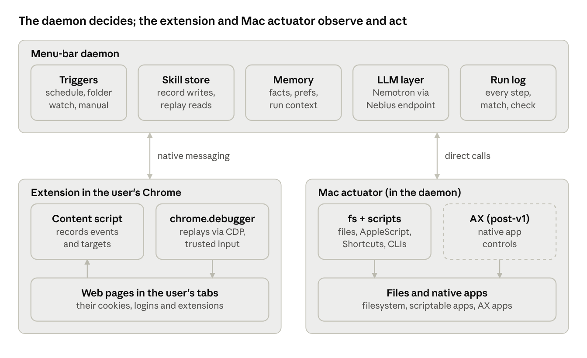

# Task Player Design

> Snapshot of the live design doc (as of Sep 30, 2026). The live doc is the source of truth while we iterate; re-export it here when it changes. The skill schema's source of truth is `packages/core/src/skill.ts`.

We record a task once in the user's own Chrome and Mac, compile it into a reusable skill, and replay it in the background: deterministic matching first, an LLM agent only when a step fails.

## Goals and scope

v1 replays mixed web + Mac tasks in the user's own Chrome (their cookies, logins and extensions), in the background where possible, and survives ordinary UI drift.

**In scope for v1**

- Teach a task by doing it once (event recording) or by describing it in natural language, with the system asking clarifying questions.
- Save each taught task as a reusable **skill** (earlier drafts called these "plans").
- Replay web steps in the user's real Chrome through our extension, including file uploads without the native Open dialog.
- Replay OS steps through non-UI routes first: filesystem, AppleScript, Shortcuts, CLIs.
- Self-heal: when a stored target no longer matches, an LLM agent finds it and the fix is written back to the skill.
- Persistent memory: facts, preferences and context gathered across teaching and runs, stored locally.
- Private by default: an NVIDIA Nemotron model on our own Nebius Serverless endpoint; skills, memory and logs never leave the Mac.
- Always-on: tasks fire from triggers (schedule, folder watch, manual) via a menu-bar daemon.

**Deliberately out of scope for v1**

- Playwright or a separately launched browser. It cannot use the user's profile without a debug-port relaunch.
- Coordinate-based replay ("click at x, y").
- Screen-recording video as the source of truth for a skill. It may come back later as a teaching aid.
- Driving native apps through Accessibility (AX), except for simple cases. Planned for after v1.
- Captchas, 2FA prompts, canvas-heavy apps (Figma-style), and a signed, notarized .dmg.

## Architecture

Three processes, one skill format: the daemon owns skills, memory, triggers and the LLM; the extension and the Mac actuator only observe (record) and act (replay).

Record and replay use the same channels: the content script watches pages during recording, and `chrome.debugger` acts on the same pages during replay. Dashed = post-v1.

**Why a native host shim.** Chrome launches a fresh process for every native messaging connection, so it cannot attach to the always-on daemon. A small shim (`apps/native-host`) is what Chrome launches; it forwards bytes between Chrome and the daemon's Unix socket (`~/Library/Application Support/TaskPlayer/daemon.sock`). Constraints that follow:

- Only the extension can open the connection. It connects on startup, keeps the port open (which also keeps its service worker alive) and reconnects with backoff.
- If the daemon is down, the shim replies `daemon.offline` and exits; the extension retries.
- If Chrome is closed, Mac-only skills run normally; a skill with web steps makes the daemon open Chrome and wait for the extension to connect.
- macOS limits Unix socket paths to 103 bytes.

## Glossary

| Term | What it means for us |
| --- | --- |
| DOM | A web page as a tree of HTML elements (button, input). The extension reads and acts on it. |
| Content script | The part of the extension injected into a page. Records user events and reads the DOM. |
| CDP | Chrome DevTools Protocol: Chrome's remote-control API (navigate, click, type, upload, wait for network). |
| chrome.debugger | Extension API that speaks CDP to the user's own tabs with no special Chrome launch. Shows a "debugging this browser" bar while attached. |
| Trusted input | Clicks and keys Chrome treats as real user input (`isTrusted=true`). CDP Input events are trusted; `element.click()` from a script is not. |
| AX (Accessibility) | macOS API for reading and pressing controls in other apps, the way VoiceOver does. |
| Native messaging | Chrome's local pipe between the extension and our Mac daemon. |
| TCC | macOS permission prompts (Accessibility, Screen Recording, Automation). |
| Locator | How we remember a control: role + accessible name + nearby text, with fallbacks. Never pixel coordinates. |
| UI drift | The page changed (moved, renamed classes, new banner) but the task is the same. |
| Trace | Raw output of a recording session: events plus target snapshots. |
| Skill | Compiled, parameterised task that the replayer executes (earlier called a plan). The record/replay contract. |
| Memory | Local store of facts, preferences and run context that the compiler and agent read. |
| Nemotron | NVIDIA's family of open models. Our LLM for compiling skills and recovering failed steps. |
| Nebius Serverless | Nebius's on-demand GPU endpoints. We deploy Nemotron there on our own endpoint. |
| Native host shim | The small program Chrome launches for native messaging. Forwards bytes to the always-on daemon's Unix socket. |

## Record

Record turns one demonstration or description into a skill; its output is only valid if replay can execute it through the same channels.

**Pipeline**

1. **Capture.** The user presses Record (until the menu bar exists: a floating button the extension draws on every page while the daemon runs, or its toolbar icon; both send `record.command` to the daemon) and does the task. The daemon owns the session: it watches the filesystem itself and tells the extension to capture web events if Chrome is running. A Mac-only task never needs Chrome; a mixed task becomes one trace ordered by timestamp.
2. **Trace.** Sensors write a timestamped trace of events, each with a snapshot of its target.
3. **Compile.** An LLM turns the trace into a parameterised skill: intent, inputs, steps, success checks. It reads memory for known facts first.
4. **Drill.** The compiler asks the user about anything ambiguous, updates the skill, and saves durable answers to memory.
5. **Dry run.** Replay highlights each target without acting; the user confirms, and the skill is saved.

**Sensors**

| Surface | Sensor | Captures |
| --- | --- | --- |
| Web pages | Extension content script | click, input, change, submit, keydown (Enter, Tab), file-input change, navigation, frame and shadow-DOM path |
| Tabs and windows | Extension background worker (`chrome.tabs`, `chrome.webNavigation`, `chrome.downloads`) | tab open/switch/close, URL changes, downloads started and finished |
| Filesystem | Daemon (FSEvents) | files created, moved or renamed during the session, with paths |
| Mac apps | Task Player.app (`apps/mac`, Accessibility API, passive NSEvent monitors) | the AX element under each click, a field's final value, shortcuts, menu paths; never raw coordinates or keystrokes |
| Natural language | Daemon chat UI | the user's description, used instead of or alongside a trace |

**Target snapshot (per event).** This is what makes drift survivable, so capture all of it:

- Role and accessible name (computed, e.g. button "Upload").
- Visible text, label, placeholder, `aria-*`, `name`, `id`, `data-testid` if present.
- Nearby context: parent landmark or section heading, and label text next to it.
- Fallback selectors: a stable CSS selector and an XPath, ranked by stability.
- Frame path and shadow-root path.
- A small cropped screenshot of the element and the URL at that moment.

**Compiler responsibilities**

- Collapse noise: per-keystroke inputs become one `type` step; accidental clicks and scrolls are dropped.
- Find parameters: typed values, chosen files and dates become named inputs ("newest PDF in ~/Downloads", not a fixed path).
- Pick the best channel per step: a Finder drag becomes a filesystem move; a web upload becomes an `upload` step with a path.
- Add waits and success checks: what must be true after each step (URL matches, element visible, file exists).
- Mark risky steps (submit, pay, send, delete) as needing approval.
- Ask, don't guess: every ambiguity becomes a clarifying question for the drill phase.

**Record must not**

- Store raw coordinates as the primary locator.
- Record password fields' values. Mark them as a secret input instead.
- Emit steps the replayer has no action for. The action list in "The skill format" is the contract.

## The skill format

The skill is the only interface between record and replay: record writes it, replay reads it, and any change to it is agreed by both teams. The source of truth is the zod schema in `packages/core/src/skill.ts`; this is the shape.

**Skill fields**: `id`, `version`, `intent` (one sentence), `inputs` (named, typed, with a resolver), `triggers`, `steps`, `success` (checks for the whole task).

**Step fields**: `id`, `intent` (what this step achieves, in words; the agent fallback relies on it), `channel`, `action`, `target` (locator, if any), `args`, `wait` (precondition), `check` (postcondition), `requires_approval`, `on_fail` (retries, then fallback: `agent` or `ask`).

**Also on steps and inputs**: `save_as` stores a step's result for later steps as `{{vars.<name>}}`; `timeout_ms` bounds a step's wait and check; inputs may carry a `default`. Templates available in args and checks: `{{inputs.<name>}}`, `{{inputs.<name>.name}}` (a file's base name), `{{vars.<name>}}`, `{{today}}`. The per-action args are listed at the top of `packages/core/src/skill.ts`.

**Added with the record/replay merge (Oct 3)**: `web.drag { to }` moves the target onto another element (HTML5 drag events for `draggable` sources, a trusted press-move-release otherwise). `web.upload` accepts a target that is the file input, the control that opens it, or a drop zone: replay looks for the file input in the target's dialog or the page (shadow roots included) and drops the files when there is none. `web.extract { source: "google_sheet" | "table" }` returns rows as objects. The `data` channel works on saved rows: compile writes a `data.pick` rule once; `data.ai` is only for what no rule can express, is shown to the user with its cost before saving, and is capped per run. Uploads through the extension need "Allow access to file URLs" on the extension: without it Chrome answers `DOM.setFileInputFiles` with "Not allowed".

| Channel | Actions (v1) |
| --- | --- |
| `web` | `navigate`, `click`, `type`, `select`, `press`, `upload`, `drag`, `wait_for`, `extract` |
| `fs` | `find`, `move`, `copy`, `rename`, `read`, `write` |
| `script` | `applescript`, `shortcut`, `shell` (allow-listed) |
| `data` | `pick` (a rule over saved rows; no model), `ai` (one model call per run, capped and cached) |
| `ax` | `open`, `press`, `set_value`, `focus`, `menu`, `key` (run by Task Player.app; see docs/guide/11-mac-apps.md) |
| `vision` (fallback only) | `click`, `type`: never written by the compiler, only chosen by replay |

See `skills/real/` for five replay test skills against real sites.

## Replay

Replay executes a skill step by step through the cheapest channel that works, with no LLM call unless a step fails.

**Channel preference (cheapest and most background-friendly first)**

1. API, CLI, filesystem or AppleScript/Shortcuts: no UI at all.
2. Web through the extension (`chrome.debugger` + CDP): the user's real Chrome, works in a background tab.
3. Native app through AX (post-v1): usually needs the app active.
4. Screenshot + vision model: last resort, needs a visible window and Screen Recording permission.

**Per-step loop**

1. **Resolve inputs.** Fill `{{inputs.*}}` (e.g. find the newest matching file).
2. **Wait.** Poll the step's precondition with a timeout: element present and enabled, network idle, URL matches.
3. **Match (deterministic).** Score candidates against the stored locator in order: role + name, then label or nearby text, then fallback selectors. Accept only one clear winner above a confidence threshold.
4. **Approve.** If `requires_approval`, pause and ask the user (menu-bar notification).
5. **Act.** Execute through the step's channel. Web uses trusted CDP input: a mouse press at the element's current centre after checking nothing covers it, and typing as a keyDown/keyUp per character (`Input.insertText` alone skips key events, and widgets such as date pickers then overwrite the field). Uploads use `DOM.setFileInputFiles` with the local path, so no native Open dialog appears.
6. **Verify.** Evaluate the postcondition. Success moves to the next step.
7. **Retry.** On failure, retry up to `on_fail.retries` times after re-observing the page (dismiss known banners, wait longer).
8. **Agent fallback.** Send the LLM the step's `intent`, the stored target snapshot, relevant memory and the current page (compact DOM/AX outline, plus screenshot if needed). It returns a new target or a short sequence of actions, which go through the same act and verify steps.
9. **Escalate.** If the agent fails or is unsure, pause the run and ask the user, showing where it stopped.

**Matcher v0 (built).** Signals are Chrome's own accessibility tree (`Accessibility.queryAXTree`: role, with equivalent roles grouped, and accessible name), stored attributes and fallback selectors, weighted 0.45 / 0.25 / 0.30 and normalised over the signals the locator has. A target is accepted at score ≥ 0.5 with a margin of 0.15 over the runner-up; otherwise the step reports "not found" or "ambiguous" with the top candidates. Navigation waits only for the document to be parsed; each step then waits for its own target.

**Learn-back.** When the agent's fix passes verification, replay proposes a new skill version with the updated locator (the old one stays as a fallback). The user approves it the first time; later, small locator fixes can be applied automatically. This is how drift handling improves over time.

**Background behaviour**

- Web runs in a dedicated Chrome window the user can minimise; CDP input works without focus.
- Chrome throttles background tabs. If a page stalls, bring its tab to front in the automation window (never the user's active window).
- Steps that must be foreground (AX, vision) are grouped into a short "taking over" session and the user is notified first.

**Run log.** Every run records each step's channel, matched target, match score, action, check result, retries, and any agent calls with their inputs and outputs. This is also the debugging tool for the record team.

## Memory

The daemon keeps a local memory that the compiler and the agent both read, so the assistant gets better at the user's tasks over time.

| Kind | Example | Written by | Read by |
| --- | --- | --- | --- |
| Facts | "Invoices from Acme go to portal X" | Compiler (drill answers) | Compiler, agent |
| Preferences | "Name uploads YYYY-MM-DD-vendor.pdf" | Compiler, user | Compiler |
| Run context | An order number or total pulled out by an `extract` step | Replay | Later steps and later runs |
| Site notes | "Portal X shows a cookie banner first" | Learn-back | Replay, agent |

Storage is SQLite in the daemon's data folder: text entries tagged with the skill they came from, with full-text search to pick what goes into a prompt. Users can view and delete any entry. Memory never stores secrets.

## Always-on

The daemon turns saved skills into runs: a trigger fires, inputs resolve, and the replayer executes with no user present.

- **Triggers (v1):** `manual`, `schedule` (cron), `folder_watch` (FSEvents). Later: new email, calendar event, webhook.
- **Run lifecycle:** queued → running → waiting_approval | waiting_user → succeeded | failed. One run at a time per Chrome window.
- **Missed runs:** if the Mac was asleep, run once on wake and log the gap; never replay a backlog silently.
- **Notifications:** the menu bar shows current run, approvals pending and last failures.

## Safety and privacy

The extension can drive every tab and the agent reads untrusted web pages, so both teams treat page content as data, never instructions.

- **Approval gates:** steps that submit, pay, send, delete or post require approval unless the user has pre-approved that skill version.
- **Prompt injection:** the agent fallback may only return targets and actions for the current step's `intent`; it cannot add steps, change URLs outside the skill's domains, or read other tabs.
- **Secrets:** passwords and tokens are never recorded, stored in memory or sent to the LLM; they are secret inputs resolved from macOS Keychain at run time.
- **Model:** all LLM calls go to an NVIDIA Nemotron model on our own Nebius Serverless endpoint, not a shared third-party API.
- **Data leaving the Mac:** only when compiling a skill or recovering a failed step. Snapshots are cut to the area around the target, with input values and password fields removed.
- **Local by default:** skills, memory, traces and run logs live only on the user's Mac.
- **Scope:** the extension attaches `chrome.debugger` only to tabs in the automation window, and only during a run.
- **Audit:** the run log is kept locally and can be exported for debugging.

## Build order and ownership

The shared core (skill schema, element descriptor, page snapshot, extension shell, bridge, LLM client) comes first because both teams build on it; after that record and replay proceed in parallel. The submission deadline is October 30, 2026.

| # | Milestone | Owner | Done when |
| --- | --- | --- | --- |
| 0 | Shared core: skill schema + 3 example skills, element descriptor, page snapshot, extension shell, bridge, Nemotron client | Both | Schema merged; examples validate; extension and daemon exchange a message |
| 1 | Web replayer in the extension (`chrome.debugger`) | Replay | Hand-written upload skill runs in a background tab |
| 2 | Recorder: content script + tab events + trace format | Record | A demonstration produces a complete trace |
| 3 | Compiler: trace or NL → skill, with clarifying questions | Record | Compiled skill replays without edits |
| 4 | Deterministic matcher + agent fallback + learn-back | Replay | Skill still runs after we change the page's button text and layout |
| 5 | Memory store read by compiler and agent | Both | A drill answer is reused in the next compile without asking again |
| 6 | Daemon: triggers, fs/script channels, run log | Replay | Folder-watch trigger runs the upload skill end to end |
| 7 | Submission: demo video, demo URL, README setup | Both | Submitted before Oct 30, 2026 |
| 8 | AX channel, vision fallback, signed .dmg | TBD | Post-hackathon |

## Hackathon fit

We are entering the Personal AI track of the [Nebius x NVIDIA Global AI Hackathon](https://nebiusglobalaihackathon.devpost.com/); every mandatory requirement maps to a part of this design.

| Track requirement | Where we meet it |
| --- | --- |
| Always-on | Daemon with triggers |
| Private, data under user control | Local skills, memory and logs; our own Nemotron endpoint; redacted snapshots |
| Persistent memory | Memory store |
| Reusable skills | Skills, improved by learn-back |
| Tools across daily workflows | Web via the extension, Mac via the actuator |
| At least one NVIDIA open model | Nemotron for the compiler and agent |
| Suggested tools (optional) | Nebius Serverless hosts the model. NemoClaw/OpenShell only as a stretch, if it runs on macOS |

Submission also needs a public repo with an open-source license (MIT), README setup steps, a demo video of 3 minutes or less, and a working demo URL.

## Open questions

- [x] Deadline: hackathon build, due October 30, 2026.
- [x] LLM provider: NVIDIA Nemotron on our own Nebius Serverless endpoint.
- [ ] Which Nemotron model and size for the compiler and agent, and which vision-language model for the fallback?
- [ ] What counts as a "working demo URL" for a Chrome extension + Mac app? Ask the organisers; fallback is a hosted page showing skills and run logs.
- [ ] Is the "debugging this browser" bar acceptable for our users, or do we need a content-script-only mode for some sites?
- [ ] Match confidence threshold and when learn-back may apply fixes without asking.
