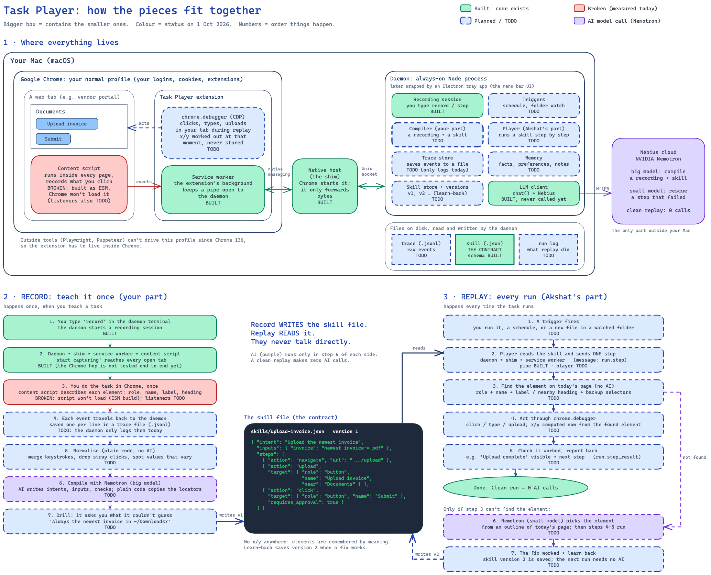

# Task Player: the guide

> **Superseded (Oct 8, 2026).** This note describes the flat-skill flow from before the workflow pivot (describe + record with screenshots and voice → editable workflow tree → self-correcting replay). It is kept as history; the current design is [docs/design.md](../design.md).

> Written 1 Oct 2026 (Thursday, Sprint 2, day 3 of 7) against commit `351a7ea`.
> Built from four sources, in this order of trust:
> 1. **the code** in this repo, read file by file and run where possible;
> 2. **primary docs** fetched today (Chrome's remote-debugging blog, Chrome's service-worker lifecycle doc, OpenAI's community post);
> 3. **the project sheet** (Nebius Project Plan: Idea, Sprints, Sheet4, Tasks Manager);
> 4. **the research dossier** and the Cursor research chat (`docs/research/cursor-chat-task-replay.md`).
>
> Where the dossier and the code disagree, the code wins, and the disagreement is written down in [01](01-status-and-diff.md).
>
> **Update, 3 Oct:** the record half has since been built and checked ([09](09-record-explained.md)), then merged with Akshat's replay engine, which now replays recorded skills ([10](10-merge-and-hot-edges.md)). The status sections in 01, 05 and 07, the tracker TSV, and the BUILT/BROKEN/TODO tags in both diagrams describe the code as of 1 Oct. Where they disagree with 09, 09 is current.

---

## The whole product in one picture

How to read it:

- **Panel 1** shows *where* each piece lives. A box inside a box means "runs inside". Your Mac contains Chrome, which contains the extension. Nemotron is the only piece outside the Mac.
- **Panels 2 and 3** show *in what order* things happen, top to bottom. Record (left) and replay (right) never talk to each other. They meet only at the skill file in the middle: record writes it, replay reads it, and learn-back writes version 2.
- **Colour** is today's status. Green is built, red is broken, dashed blue is TODO, and purple is a call to the AI model.

To edit it, open [`architecture-map.excalidraw`](architecture-map.excalidraw) at [excalidraw.com](https://excalidraw.com) (menu → Open) or in the VS Code Excalidraw extension.

### Step by step: what happens when you click

[`how-it-works.png`](how-it-works.png) (editable: [`how-it-works.excalidraw`](how-it-works.excalidraw)) zooms in. It's seven connected diagrams in the same eight columns: You, Web page, Page watcher, Ext. background, Helper, Desktop app, Files on disk, AI. Each arrow is one numbered step, and the right column says whether that step is built today.

0. Who's who
1. Starting up
2. You press Record
3. One click, captured
4. Typing and picking a file
5. Stop → a skill
6. Running it later
7. The page changed (self-healing)

---

## Read in this order

| # | File | Answers |
|---|---|---|
| 01 | [Status and diff](01-status-and-diff.md) | What exists today. Does the design, the dossier and the code say the same thing? |
| 02 | [Product and architecture](02-product-and-architecture.md) | The idea broken down, record vs replay, the three processes, folder structure |
| 03 | [Tools: Chrome, Playwright, Electron, OpenAI](03-tools-chrome-electron-openai.md) | Which tool, why Playwright opens a new profile, Electron vs extension, how OpenAI built Record & Replay |
| 04 | [Capture without coordinates](04-capture-without-coordinates.md) | How clicks become objects; why x/y is never stored; what screen recording can and cannot give |
| 05 | [The context layer (your part)](05-context-layer.md) | What "context layer" means, stage by stage, with the contracts you must hit |
| 06 | [Processing with models, and learning from drift](06-processing-and-learning.md) | Where Nemotron runs, what it sees, what "the model learns the new UI" really means |
| 07 | [How to proceed + Sheet6 tracker](07-how-to-proceed.md) | Order of work for the rest of Sprint 2, the DSU decisions, the tracker |
| 08 | [FAQ](08-faq.md) | The naive questions that come up while building this |
| 10 | [Record meets replay, and the hot edges](10-merge-and-hot-edges.md) | The merge with Akshat's replay, the shared skill contract, file drops, drag, copy/paste, Google Sheets, AI cost limits |
| 11 | [Mac apps: the Accessibility API, and the desktop button](11-mac-apps.md) | Recording and replaying clicks, typing, shortcuts and menus in any Mac app; how the permission works; the floating desktop button; a mixed web + file + app recording |
| 12 | [How it works, in plain words](12-how-it-works-simply.md) + [diagram](12-how-it-works-simply.excalidraw) | Start, record, stop, replay end to end: how web, Mac-app and file events are captured, Chrome cases, what is saved, where AI fits |
| 09 | [Record, explained and built](09-record-explained.md) | Mac events vs AX, the drill, memory, versions, injection, auth; then what was built for record, why, and how it was checked |
| — | [`sheet6-sprint2-tracker.tsv`](sheet6-sprint2-tracker.tsv) | Paste-ready rows for worksheet 6 |

## Your questions → where they are answered

| Your words | File |
|---|---|
| *"explain the difference between record and replay"* | [02 §Record vs replay](02-product-and-architecture.md#q--record-vs-replay) |
| *"tools to use (Playwright opens a new chrome profile window this behaviour is what i don't want)"* | [03 §Q1](03-tools-chrome-electron-openai.md#q1--which-tool-drives-the-users-own-chrome) |
| *"how openai made the record and replay product"* | [03 §Q3](03-tools-chrome-electron-openai.md#q3--how-openai-built-record--replay) |
| *"End goal is to create a desktop application using electron … or a chrome extension"* | [03 §Q2](03-tools-chrome-electron-openai.md#q2--electron-desktop-app-or-chrome-extension) |
| *"How the screen recording will capture the objects, clicks, actions ? it should not be dependent on x and y coordinates"* | [04](04-capture-without-coordinates.md) |
| *"processing the input using some ml model back of the hood, extracting metadata from the screenrecording"* | [06 §Q1](06-processing-and-learning.md#q1--processing-the-input-with-a-model) |
| *"if the ui gets changes the model learns it and automatically understands or maps to the instructions (updated)"* | [06 §Q2](06-processing-and-learning.md#q2--when-the-ui-changes-does-the-model-learn-it) |
| *"understand the codebase end-to-end. explain whats the current thing/status"* | [01 §Q1](01-status-and-diff.md#q1--what-exists-today) |
| *"as per the architecture sketched and what my study provided, are they same ?"* | [01 §Q2](01-status-and-diff.md#q2--design-vs-dossier-vs-code-are-they-the-same) |
| *"thinking about my part (context layer)"* | [05](05-context-layer.md) |
| *"Break down the project idea and execution along with the folder structure"* | [02](02-product-and-architecture.md), [07](07-how-to-proceed.md) |
| *"How should i proceed … make the simple task tracker … in worksheet 6"* | [07](07-how-to-proceed.md) |

---

## Six sentences that make the rest obvious

1. **The skill file is the product.** Record is a *compiler* that writes it, replay is an *interpreter* that runs it, and Nemotron is only called where the compiler or interpreter would otherwise have to guess.
2. **The plumbing and the record half are built; replay is not.** The daemon ⇄ native host ⇄ extension bridge is written and tested. Capture, trace, normalise, compile (Nemotron), drill, memory and the skill store were built on 3 Oct ([09](09-record-explained.md)). Matching and acting (replay) are still `TODO`. The full loop in your own Chrome over native messaging has not been run yet.
3. **You never need coordinates, because the browser hands you the element itself at the moment of the click.** x/y is something replay computes fresh at the last millisecond, never something record stores.
4. **Nothing gets trained.** "The model learns the new UI" means a corrected locator is written into the next skill *version*. The data changes; the model doesn't.
5. **Since Chrome 136 there is no way into the user's default profile except from inside it, and an extension is inside it.** That one fact settles Playwright, Electron and "which tool".
6. **Your part (the context layer) has exactly one output type, `Skill`, and it is only correct if replay can run it.** "Pass structured output required in Input flow" (the Sprint 2 action item) is already half-answered by `packages/core/src/skill.ts`. The other half, the *input* to your compiler, the trace, is not defined anywhere yet.

---

## What kind of thing each word is

Most confusion in this project comes from words of different kinds being used as if they competed. Here is each word with its kind:

| Word | Kind | What it is, concretely |
|---|---|---|
| **trace** | a **file format**: raw evidence | Every event captured while you demonstrate, in order. Not yet defined in code ([05](05-context-layer.md#stage-2--trace)) |
| **skill** | a **file format**: the contract | Compiled, parameterised task. zod schema at `packages/core/src/skill.ts:86`. The dossier calls this a **plan**; it is the same thing |
| **run log** | a **file**: append-only | What replay did per step. Designed (`docs/design.md:161`), not built |
| **locator** | a **data structure** inside a skill step | How a control is remembered: role, name, label, nearby text, fallback selectors. `skill.ts:20` |
| **element descriptor** | a **data structure** made at record time | A locator plus tag, URL, CSS/XPath, shadow path and optional crop. `descriptor.ts:5`. Superset of a locator |
| **daemon** | a **process**: always on | Node process that owns sessions, skills, LLM calls. `apps/daemon` |
| **native host** | a **process**: short-lived | Chrome starts a fresh one per connection, and it pipes bytes to the daemon. `apps/native-host` |
| **service worker** | a **process** Chrome may kill | The extension's background script. Dies after 30 s idle unless something keeps it alive |
| **content script** | **code injected** into every page and frame | Where capture runs. `apps/extension/src/content.ts` |
| **chrome.debugger** | an **extension API** | Lets the extension speak CDP to the user's own tabs |
| **CDP** | a **protocol** | Chrome DevTools Protocol: `Input.dispatchMouseEvent`, `DOM.setFileInputFiles`, `Accessibility.queryAXTree`… |
| **AX** (in `design.md`, the sheet) | a **macOS API** | Reading and pressing controls in *other Mac apps*. Post-v1 |
| **AX tree** (in the dossier) | a **tree Chrome computes for a web page** | Roles and names of page elements, readable via CDP `Accessibility.*`. **A different thing from macOS AX** with the same letters |
| **channel** | a **field value** on a step | `web`, `fs`, `script`, `ax`, `vision`. `skill.ts:6` |
| **memory** | a **place** (planned: SQLite) | Facts, preferences, run context, site notes. Interface only: `packages/memory/src/index.ts:14` |
| **drill** | a **phase** of record | The compiler asks you questions about what it could not infer |
| **learn-back / heal** | a **rule** about writing | After a replay fix passes its check, propose skill version N+1 |
| **context layer** | a **sheet term** for three things | Intake, memory, run-time context gathering. Split apart in [05](05-context-layer.md) |

## How claims are labelled

| Label | Meaning |
|---|---|
| **Measured** | I ran it today and the output is quoted |
| **From code** | Read at the cited `file:line` |
| **Doc-verified** | Quoted from a primary source fetched today |
| **Dossier claim** | From the research dossier; not checked here |
| **Reasoned** | Follows from the above, but not run |
