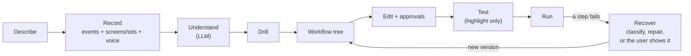

## The project is based of the following concept:
Its an smart automation layer but works for any kind of task we generally do at work. to setup a task you show it how its done (by a screen recording(stretch goal) or in natural language where it might drill you if it has any questions) then it smartly manages the task. The smart layer supports - understand a new task so later on system can replay it, decision making for any common occuring situations (like layout drifts), context gathering while doing the task etc. Its an always on system which differentiates it and make it fully autonomous

Built for the Personal AI track of the [Nebius x NVIDIA Global AI Hackathon](https://nebiusglobalaihackathon.devpost.com/): an always-on, private assistant with persistent memory and reusable skills, running on NVIDIA Nemotron models through Nebius Token Factory.

## How it works

Full design: [`docs/design.md`](docs/design.md). **Status:** the design below was adopted on Oct 8, 2026. The skill format is migrated to the workflow tree; most of the flow is not built yet ([status table](docs/design.md#status-design-vs-code)).



1. **Describe.** The user fills in a short form: **Goal**, **Frequency** (a dropdown that becomes the trigger), **What changes each run**, **What stays the same** and, optionally, **Never** (lists are comma-separated). Placeholder text explains each field, because these answers are what separate variables from constants.
2. **Record.** The user does the task their usual way while Task Player records three streams on one clock:
    - **events** in Chrome, Mac apps and Finder;
    - **a screenshot at each event**, with the user's consent: the active window, with sensitive information blacked out on the Mac before it is stored or sent ([how](#privacy));
    - **optional voice narration**, with the user's consent: transcribed on the Mac by macOS's built-in speech recognizer and timestamped against the events. The audio never leaves the Mac; the transcript does.
3. **Understand.** Nemotron 3 Super reads the description, events and transcript (and GLM-5.3-Flash's descriptions of the redacted screenshots) and drafts a **workflow**: a click on an email becomes "the newest email from this sender", changing values become variables, repetition becomes a loop. The raw recording is deleted a day after the skill is finalised.
4. **Drill.** Questions only on the steps it is unsure about; answers go to memory.
5. **Workflow tree.** The user sees the workflow as a tree. Each step is a browser or Mac action, or an **LLM step** that transforms data (summarise, classify, read a document). LLM steps never drive the UI. The tree also has **variables**, **loops** and **branches**, and any step can **ask the user** something before it runs.
6. **Edit.** The user can change any step and toggle **human approval** on any step.
7. **Test.** Play runs a **highlight-only** replay: it shows each target without acting. This mode may change.
8. **Run.** The exact tree the user saw runs from its trigger. Actions are deterministic; no model call unless an LLM step needs one or a step fails.
9. **Recover.** When a step fails, the failure is classified first: a site that is down is retried later, a login the user must do pauses the run, an empty inbox ends it as nothing to do, and only a changed page or app is **repaired**. Repair may change any part of the workflow, but never adds outward actions, changes what the user decided or turns approvals off, and is kept only with evidence it worked: then it becomes the **new version**, the user is notified and can roll back in one click. If repair can't fix it, the run pauses and the user **shows the step once** while Task Player records; that becomes the fix and the run resumes.

**Components.** An always-on **daemon** (workflows, versions, triggers, memory, run log, all model calls), **Task Player.app** (Record button, Mac app capture and replay through the Accessibility API, screenshots and their redaction, voice and transcription), the **Chrome extension** (web capture and replay through `chrome.debugger` in the user's own Chrome) and a tiny **native-host shim** (Chrome launches a fresh process per native messaging connection, so the shim forwards bytes to the daemon's socket). There is **no backend server**: the daemon calls Nebius Token Factory directly with the user's own API key, kept in the macOS Keychain.

**Memory.** Local SQLite in the daemon: drill answers, run context, and site notes from debug fixes. Never secrets.

## NVIDIA Nemotron on Nebius Token Factory

Every model call goes through `packages/llm` to **Nebius Token Factory**. Callers pick a profile; understanding recordings and recovering from failures are **agents** built on `packages/agent` ([design](docs/design.md#agents)).

| Profile | Model | Used by |
| --- | --- | --- |
| `fast` | **NVIDIA Nemotron 3.5 Lightning** | The workflow's LLM steps on every run: summarise an email, read an invoice, classify a ticket. Cheap and fast ($0.06 / $0.24 per 1M tokens), thinking off, output checked against the step's type |
| `smart` | **NVIDIA Nemotron 3 Super** | The **repair agent** (works out why a step failed on a changed page, fixes the workflow, verifies, saves a new version) and the **design agent** (turns a description, recording and transcript into a workflow) |
| `vision` | GLM-5.3-Flash | The agents' screenshot tool: describes redacted screenshots (the cheapest vision model on Token Factory) |

Why Token Factory: one OpenAI-compatible API for every profile, structured JSON output with a schema, Nemotron's thinking switched on or off per call, and **Zero Data Retention**, which we require on the account so prompts are neither stored nor used for training. Details, costs and limits: [docs/design.md#models](docs/design.md#models).

## Privacy

- **Consent first.** Screenshots and the microphone are separate opt-ins; without them, recording works from events alone.
- **Redaction before upload.** No screenshot while a password field has focus or a blocked app or site is open; password, payment and user-marked fields are blacked out from the page's or app's own structure; then on-device text recognition (Apple's Vision framework) blacks out emails, phone and card numbers, IBANs, ID numbers, API keys and the description's "Never" terms.
- **Audio stays on the Mac.** Only its transcript is sent.
- **Short-lived recordings.** Raw recordings are deleted 24 hours after the skill is finalised; skills never contain images or audio.
- **Only Nebius sees data.** No server of ours sits in between; Token Factory runs with Zero Data Retention.

Details: [docs/design.md#consent-redaction-and-retention](docs/design.md#consent-redaction-and-retention).

## Success metric: task coverage

**Task coverage = the share of real workflows that work from a recording of a person doing them their usual way.** The workflows are the 15 in [`docs/examples.md`](docs/examples.md), written from the user's side (what they see, click, copy and type), not as a program would do them.

The test for each one: someone who normally does the task does it while Task Player records, with no instructions on how. Then the next real occurrence runs by itself.

- **1, done:** unattended from its trigger, correct result, three real occurrences in a row.
- **0.5, partly:** correct result when started by hand, possibly with the user doing one step or answering one question.
- **0, not yet:** a core step fails, or a run gives a wrong result (for example a date from the recording replayed as is).

Coverage is the sum of the scores divided by 15. Next to it we track the same scores for skills a developer writes by hand: the gap between the two is what recording and compiling still have to learn.

| Date | Coverage (from a recording) | Hand-written skills | Biggest gaps |
| --- | --- | --- | --- |
| 2026-10-06 | **7%** (1 / 15) | 23% (3.5 / 15) | dates and values that should change but replay literally; "for each" from repeated actions; choosing by sight; text typed from memory; triggers |

Today's values are **estimated by reading the code**, which still implements the old flat-skill flow: they are the baseline the new workflow design is measured against. Nobody has recorded these workflows yet. To measure them, have a person who really does the workflow fill in the description and record it (narrating if they like), keep the recording in `fixtures/traces/`, and replay on the next occurrence.

## Repository Guide

TypeScript monorepo (pnpm workspaces). One language so the extension and the daemon share the same schema, descriptor and matcher code.

```
.
├── packages/
│   ├── core/          # JOINT   workflow schema and checker, edit operations, repair guard, capability briefing, element descriptor, extension↔daemon messages
│   ├── llm/           # JOINT   all model calls to Nebius Token Factory: client, profiles (fast, smart, vision), structured output, usage
│   ├── agent/         # JOINT   the agent runtime: loop, tools, guard, budgets, transcript
│   ├── memory/        # JOINT   persistent memory store (interface now, SQLite later)
│   ├── ipc/           # JOINT   length-prefixed framing (native messaging + daemon socket), socket path
│   ├── recorder/      # RECORD  trace normaliser, compiler, drill questions (to become: understand → workflow tree)
│   └── player/        # REPLAY  step loop, matcher, channels (to gain: workflow interpreter, debug + versions)
├── apps/
│   ├── extension/     # Chrome MV3 extension: background worker (native port, chrome.debugger), content script
│   ├── mac/           # Task Player.app (Swift): Record button, Mac app capture and replay via Accessibility
│   ├── native-host/   # shim Chrome launches: pipes native messaging <-> the daemon's Unix socket
│   └── daemon/        # always-on Node daemon: socket server, recording sessions, skill store, triggers, fs/script channels
├── skills/real/       # 5 replay test skills against real sites (see skills/real/README.md)
├── fixtures/
│   ├── pages/         # local test pages, including a "drifted" redesign
│   └── snapshots/     # saved copies of the real pages; tests check every locator against them
├── scripts/           # fixture server, native host installer, sandbox seeder, page snapshots
├── docs/              # design.md (current design), examples.md (15 real workflows), guide/ (earlier notes)
└── .github/           # CI (lint, typecheck, test, build) and CODEOWNERS template
```

**Who touches what**

| Area | Owner | Rule |
| --- | --- | --- |
| `packages/core`, `packages/llm`, `packages/memory`, `packages/ipc`, `skills/` | Both | Changes need a review from both sides; the skill schema is the contract |
| `packages/recorder`, recording code in `apps/extension/src/content.ts` | Record | |
| `packages/player`, replay code in `apps/extension/src/background.ts`, `apps/daemon`, `apps/native-host` | Replay | |

Workspace packages are consumed as TypeScript source (no build step); only the extension and the native host are bundled (esbuild).

## Running Guide

> These steps run the **current code**: record → compile → `run`. Skills use the new workflow format, and the player runs the whole tree: loops, branches, llm steps, asks and approvals. Recording does not build loops or branches yet; write them by hand (see `skills/real/sort-inbox.json`).

**Prerequisites**: macOS, Node 22+, pnpm 10 (Node ships it through corepack: run `corepack enable pnpm` once), Google Chrome, and for Mac apps the Xcode command line tools (`swiftc`; `xcode-select --install`).

```sh
pnpm install
cp .env.example .env        # fill in your Nebius Token Factory API key (models are optional overrides)
pnpm llm:check              # checks each model profile with that key: answers, json_schema, tool calls, images (< $0.01)

pnpm test                   # schema, framing and daemon socket tests
pnpm typecheck
pnpm lint                   # Biome; `pnpm format` to auto-fix

pnpm fixtures               # serves fixtures/pages on http://localhost:5173
pnpm seed:sandbox           # creates ~/TaskPlayerTest with sample files for skills/real (--reset to start over)
pnpm snapshot:pages         # re-downloads the real pages into fixtures/snapshots
pnpm extension              # builds apps/extension/dist in watch mode
pnpm daemon                 # runs the daemon (daemon:dev = watch mode, but it also reads Enter); type record, stop (compiles the recording; answer its questions), run <skill-id | skill.json>, approve, deny, skills, traces, status
```

**Replay a skill**

```sh
pnpm seed:sandbox                                        # once: sample files in ~/TaskPlayerTest
pnpm replay skills/real/fill-web-form.json               # dev runner: separate Chrome profile, no extension needed
pnpm replay skills/real/upload-test-file.json --yes      # --yes approves gated steps; --headless, --no-scripts, --keep-open
```

`pnpm replay` launches its own debug-port Chrome (profile in `~/Library/Application Support/TaskPlayer/dev-chrome`). The production path is the daemon: type `run skills/real/<skill>.json` in `pnpm daemon`, and web steps run in an automation window of your own Chrome through the extension. Both paths share the player code, and every daemon run is logged to `~/Library/Application Support/TaskPlayer/runs/<runId>.jsonl`.

**Connect Chrome to the daemon** (once per machine):

1. `pnpm setup:native-host` builds the shim and registers it with Chrome (`--uninstall` to remove). It writes `~/Library/Application Support/TaskPlayer/native-host` and `~/Library/Application Support/Google/Chrome/NativeMessagingHosts/com.taskplayer.daemon.json`.
2. Open `chrome://extensions`, enable Developer mode, click "Load unpacked" and pick `apps/extension/dist`. The manifest's `key` pins the extension ID to `eloljjdiofhdlhoankjbhfeihjankikk`, which is the only origin the host allows. Then open the extension's Details and turn on **Allow access to file URLs**: without it Chrome refuses to hand local files to a page, so upload steps fail with "Not allowed".
3. Run `pnpm daemon`. The extension reconnects within a minute, or immediately if you reload it. `status` in the daemon shows connected extensions.

**Record Mac apps and get the desktop button** (once):

1. `pnpm setup:mac` builds `apps/mac/build/Task Player.app` (rebuilt only when its sources change). `pnpm daemon` starts it; it quits when the daemon does.
2. Right-click the floating button → **Allow Mac apps**: macOS asks, then turn on Task Player in System Settings → Privacy & Security → Accessibility. The permission goes to Task Player only, never to your terminal. After a rebuild, turn it off and on again (the app is signed ad hoc, so the permission is tied to that build).
   Without it, web pages and files are still recorded; Mac apps are not. If turning it off and on doesn't take after a rebuild, run `tccutil reset Accessibility com.taskplayer.mac` and allow it again.
   Finder is recorded by what it does to files (moves, renames), not by its clicks. File moves anywhere in your home folder are recorded with no setup (macOS asks once for Desktop, Documents and Downloads when the daemon starts); a folder outside it, such as an external drive, is added when a Finder window shows it.

**Record and replay** (each time):

1. `pnpm daemon` in a terminal you can see (not `daemon:dev`: its watch mode also reads Enter, which drill answers need).
2. Press the round **record button** at the bottom right of your screen (Task Player.app, above every app; drag it anywhere). Do the task in Chrome, Finder or any Mac app, then press **Stop**. Without Task Player.app, the same button appears inside Chrome pages instead, and the extension's toolbar icon does the same.
3. The daemon compiles the recording and asks its questions **in the terminal** (Enter takes the default); the button says when one is waiting, then shows the saved skill's id.
4. If the task used a file (an upload, a file you moved), `run <id>` first asks **which file** to use this time: Enter takes the suggestion (the newest file like the one you recorded), or type a path, or drag any file from Finder into the terminal window. Or give it with the command: `run <id> ~/Desktop/new.jpeg` (type `run <id> ` and drag the file in). When you stop a recording you can instead choose "the newest of its kind" or "always this file", and then it doesn't ask. Every file is checked before the first step runs: it must exist, not be empty, and be a kind the step takes (the page's own file-field rule, else the kind you recorded with: a photo means any image). A wrong file is explained and asked for again; given with the command, it stops the run.
5. `run <id>` in the terminal replays it in a separate, unfocused 1280×800 Chrome window (switch to it to watch; Chrome shows its "started debugging this browser" bar while it runs). Steps that submit wait for `approve`. Each step prints ✓ or ✗.

After `git pull`, run `pnpm build` again and reload the extension in `chrome://extensions`.

The daemon listens on `~/Library/Application Support/TaskPlayer/daemon.sock`. Override it with `TASKPLAYER_SOCKET`, keeping the path at 103 bytes or less (a macOS limit for Unix sockets).

## Deployed Link

Test build: a GitHub Release with the `.dmg` (Task Player.app with the daemon) and the Chrome extension. Link to be added when the first release is published.

## Deployment Guide

There is no server to deploy: everything runs on the user's Mac and calls Nebius Token Factory directly.

1. Create a Nebius Token Factory API key and turn on **Zero Data Retention** for the organization.
2. Install the release: open the `.dmg` (unsigned, so right-click → Open) and load the extension in `chrome://extensions`.
3. On first launch, paste the key. It is stored in the macOS Keychain, and a connection check confirms Nemotron answers.
4. Allow the macOS permissions it asks for: Accessibility; Screen Recording, Microphone and Speech Recognition only if you consent to screenshots and narration.

## License

[MIT](LICENSE)
